# day 1 recap 

## different docker client options 


## day1 recall done 


## image metdata id store 

```
[root@ip-172-31-71-211 ~]# cd /var/lib/docker/
[root@ip-172-31-71-211 docker]# ls
builder  buildkit  containers  image  network  overlay2  plugins  runtimes  swarm  tmp  trust  volumes
[root@ip-172-31-71-211 docker]# cd  image/
[root@ip-172-31-71-211 image]# ls
overlay2
[root@ip-172-31-71-211 image]# cd overlay2/
[root@ip-172-31-71-211 overlay2]# ls
distribution  imagedb  layerdb  repositories.json
[root@ip-172-31-71-211 overlay2]# cd  imagedb/
[root@ip-172-31-71-211 imagedb]# ls
content  metadata
[root@ip-172-31-71-211 imagedb]# cd  content/
[root@ip-172-31-71-211 content]# ls
sha256
[root@ip-172-31-71-211 content]# cd  sha256/
[root@ip-172-31-71-211 sha256]# ls
025c6b9a7111fb1ed60d0bead053e98a8c59dc3cfa06dc6960cb7e4168c3f103
027722679e34c6965b8e953f76260495b05ad4aa6cf3c6e3a6fce889cdadc1f6
10ea5866863f568870e7fb2f14c98032ad12334ebb702b85d75c4664efee4104
1d66478208a1c5ca091ad46c51f554b71029f88c5782e6911f67b706785d23f3
1ee94edcff43abb805d0e0bd6cf2a865e8fa09e2157142ceb2fe7109a7306b30
1f28d532f453d9b759c802feef4633c2313d5f56521f3dafbd1

```

# Docker networking 

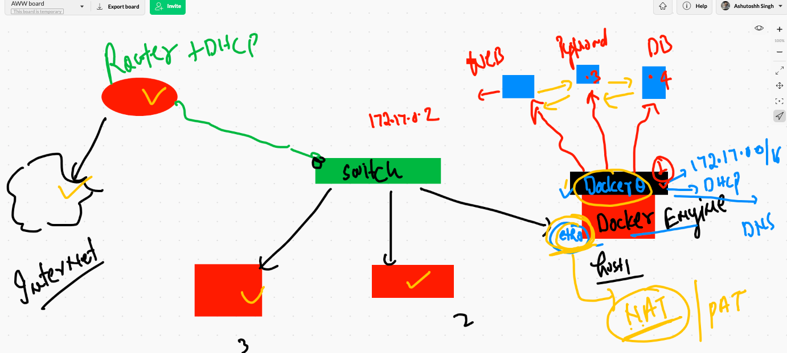

## testing container connection 

## creating container 

```
❯ docker  run  -itd --name ashuc1  alpine  ping 127.0.0.1
b17b437f0fd087c1f89f568058c840aae03a312ca398691d32e2ae9877c04123
❯ docker  ps
CONTAINER ID   IMAGE     COMMAND            CREATED         STATUS         PORTS     NAMES
b17b437f0fd0   alpine    "ping 127.0.0.1"   8 seconds ago   Up 7 seconds             ashuc1

```

## checking container ip 

```
❯ docker  inspect  ashuc1  -f='{{.Id}}'
b17b437f0fd087c1f89f568058c840aae03a312ca398691d32e2ae9877c04123
❯ docker  inspect  ashuc1  --format='{{.Id}}'
b17b437f0fd087c1f89f568058c840aae03a312ca398691d32e2ae9877c04123
❯ Status
zsh: command not found: Status
❯ docker  inspect  ashuc1  --format='{{.State.Status}}'
running
❯ docker  inspect  ashuc1  --format='{{.NetworkSettings.IPAddress}}'
172.17.0.2
❯ docker  ps
CONTAINER ID   IMAGE     COMMAND            CREATED         STATUS         PORTS     NAMES
e5178b8d3763   alpine    "ping 127.0.0.1"   4 minutes ago   Up 4 minutes             samithp
ce7a6231f8a6   alpine    "ping 127.0.0.1"   4 minutes ago   Up 4 minutes             devac2
ff975367e8a2   alpine    "ping 127.0.0.1"   5 minutes ago   Up 5 minutes             nrupanag
6c3f02295e12   alpine    "ping 127.0.0.1"   5 minutes ago   Up 5 minutes             theep1
0d7396076f1c   alpine    "ping 127.0.0.1"   5 minutes ago   Up 5 minutes             prach2
a8bdf330fee3   alpine    "ping 127.0.0.0"   5 minutes ago   Up 5 minutes             sebc1
25ec316cd465   alpine    "ping 127.0.0.1"   5 minutes ago   Up 5 minutes             gobic1
ea00dceb9410   alpine    "ping 127.0.0.1"   5 minutes ago   Up 5 minutes             saicn1
e55b575d4260   alpine    "ping 127.0.0.1"   6 minutes ago   Up 6 minutes             geethsc1
1b9c3c347973   alpine    "ping 127.0.0.1"   6 minutes ago   Up 6 minutes             anwec1
7577c47cf814   alpine    "ping 127.0.0.1"   6 minutes ago   Up 6 minutes             srir
5631cfb87228   alpine    "ping 8.8.8.8"     6 minutes ago   Up 6 minutes             dheer
b17b437f0fd0   alpine    "ping 127.0.0.1"   6 minutes ago   Up 6 minutes             ashuc1
❯ docker  inspect  prach2  --format='{{.NetworkSettings.IPAddress}}'
172.17.0.11

```

## login into a running container 

```
❯ docker  exec  -it  ashuc1  sh
/ # 
/ # 
/ # uname 
Linux
/ # uname -r
4.14.225-169.362.amzn2.x86_64
/ # ifconfig 
eth0      Link encap:Ethernet  HWaddr 02:42:AC:11:00:02  
          inet addr:172.17.0.2  Bcast:172.17.255.255  Mask:255.255.0.0
          UP BROADCAST RUNNING MULTICAST  MTU:1500  Metric:1
          RX packets:20 errors:0 dropped:0 overruns:0 frame:0
          TX packets:0 errors:0 dropped:0 overruns:0 carrier:0
          collisions:0 txqueuelen:0 
          RX bytes:1536 (1.5 KiB)  TX bytes:0 (0.0 B)

lo        Link encap:Local Loopback  
          inet addr:127.0.0.1  Mask:255.0.0.0
          UP LOOPBACK RUNNING  MTU:65536  Metric:1
          RX packets:1162 errors:0 dropped:0 overruns:0 frame:0
          TX packets:1162 errors:0 dropped:0 overruns:0 carrier:0
          collisions:0 txqueuelen:1000 
          RX bytes:97608 (95.3 KiB)  TX bytes:97608 (95.3 KiB)
          
 ```
 
 
 ## listing docker network 
 
 ```
 ❯ docker  network  ls
NETWORK ID     NAME      DRIVER    SCOPE
7354d9814644   bridge    bridge    local
c5d821628954   host      host      local
5fa604848e5c   none      null      local

```

## listing bridge information 

```
❯ docker  network  inspect  7354d9814644
[
    {
        "Name": "bridge",
        "Id": "7354d98146445c7118a13ab0c52fc5bdae0ef525a4d237f74828f57db6bd0a88",
        "Created": "2021-04-20T04:24:37.208545025Z",
        "Scope": "local",
        "Driver": "bridge",
        "EnableIPv6": false,
        "IPAM": {
            "Driver": "default",
            "Options": null,
            "Config": [
                {
                    "Subnet": "172.17.0.0/16",
                    "Gateway": "172.17.0.1"
                }
            ]
        },
        "Internal": false,
        "Attachable": false,
        "Ingress": false,
        "ConfigFrom": {
            "Network": ""
        },
        "ConfigOnly": false,
        "Containers": {
            "0d7396076f1c4b48dd075ed623ba04f1bfd49bf1acfab731615b2ba615a876e0": {
                "Name": "prach2",
                "EndpointID": "68adf04968d3751ad401e32e949150bbeff6dbb22e3b0a53d3789d48461c8714",
                "MacAddress": "02:42:ac:11:00:0b",
                "IPv4Address": "172.17.0.11/16",
                "IPv6Address": ""
            },
            "1b9c3c347973756784c7583daf1bc2bcec384c63d38531924b5e6e78960e11a7": {
                "Name": "anwec1",
                "EndpointID": "91d73f58fd319a4be49f7c626b6f988bd616d237e05b0a487d55c8b1177ea56a",
                "MacAddress": "02:42:ac:11:00:05",
                "IPv4Address": "172.17.0.5/16",
                "IPv6Address": ""

```

## docker bridge called docker0 in host 

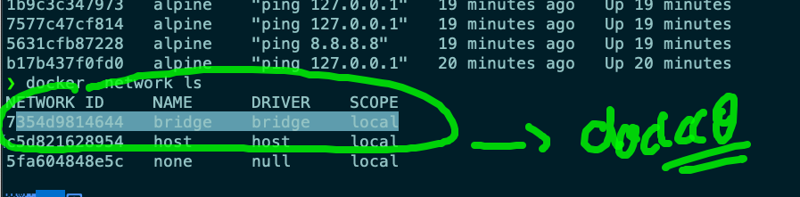

## problem using with docker0 bridge 

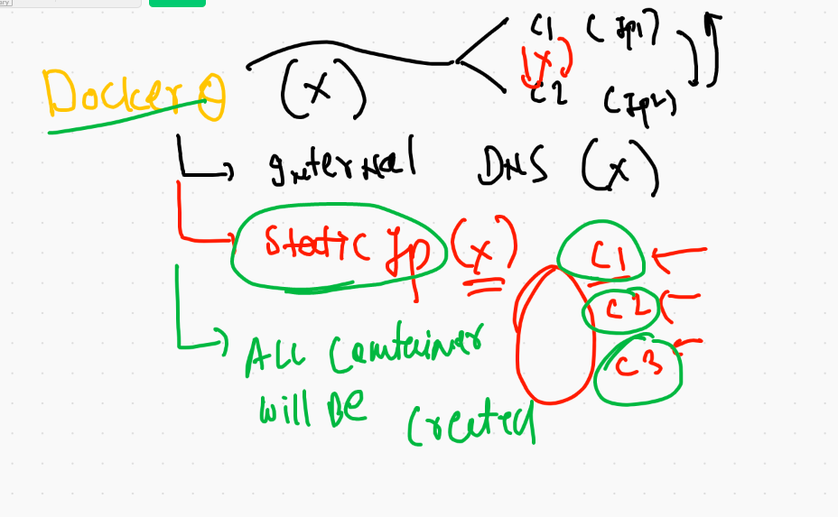

## custom docker bridge concepts 

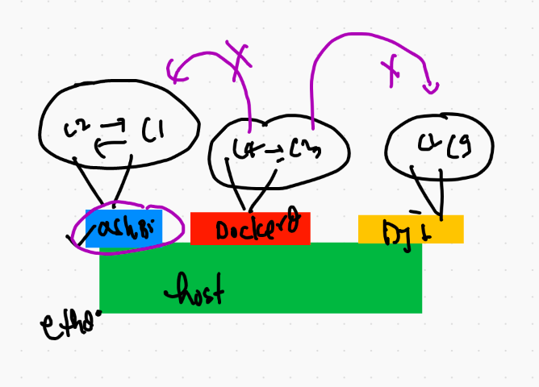

## creating custom bridge

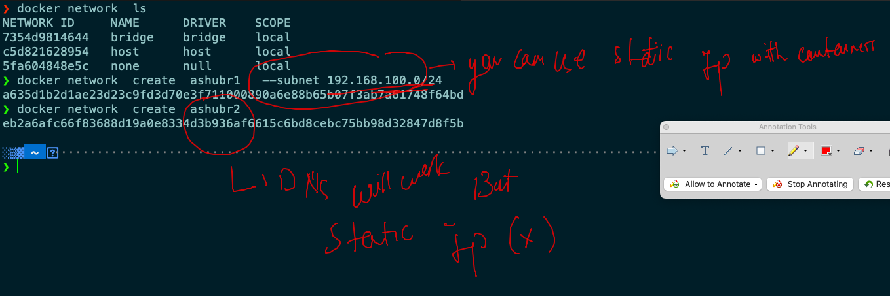

## 

```
❯ docker network  create  ashubr1   --subnet 192.168.100.0/24
a635d1b2d1ae23d23c9fd3d70e3f711000890a6e88b65b07f3ab7a61748f64bd
❯ docker network  create  ashubr2
eb2a6afc66f83688d19a0e8334d3b936af6615c6bd8cebc75bb98d32847d8f5b
❯ docker network  ls
NETWORK ID     NAME        DRIVER    SCOPE
a635d1b2d1ae   ashubr1     bridge    local
eb2a6afc66f8   ashubr2     bridge    local
7354d9814644   bridge      bridge    local
0e2103f71be2   devab1      bridge    local
a533383542b9   dheer123    bridge    local
51f5af7a48f8   dheer334    bridge    local
b0644e14d5ab   geethabr1   bridge    local
6379297bcb6b   geethabr2   bridge    local
a706ba246212   gobibr1     bridge    local
c5d821628954   host        host      local
5fa604848e5c   none        null      local
c769d2c01d02   nrupanag    bridge    local
7e75cca7cb05   prachbr     bridge    l

```
## creating containers with in custom bridge

```
10046  docker network  create  ashubr1   --subnet 192.168.100.0/24 
10047  docker network  create  ashubr2  
10048  docker network  ls
10049  docker  ps
10050  docker network  ls
10051  docker  run -itd --name ashuc2 --network ashubr1  alpine ping 127.0.0.1 
10052  docker  inspecr  ashubr1  -f='{{.NetworkSettings.IPAddress}}'
10053  history
10054  docker  inspecr  ashubr1   --format='{{.NetworkSettings.IPAddress}}' 
10055  docker  inspecr  ashuc2   --format='{{.NetworkSettings.IPAddress}}' 
10056  history
10057  docker  inspecr  ashuc2   
10058  docker  inspect  ashuc2   
❯ docker  run -itd --name ashuc3 --network ashubr1 --ip 192.168.100.23  alpine ping 127.0.0.1
fe80d652214018cc7b99bc00ac1dab30cd0c4d503c3b8800f95be2e0b716ef3b

```

## checking internal DNS

```
❯ docker  run -itd --name ashuc3 --network ashubr1 --ip 192.168.100.23  alpine ping 127.0.0.1
fe80d652214018cc7b99bc00ac1dab30cd0c4d503c3b8800f95be2e0b716ef3b
❯ docker  exec -it  ashuc2 sh
/ # ping  ashuc3
PING ashuc3 (192.168.100.23): 56 data bytes
64 bytes from 192.168.100.23: seq=0 ttl=255 time=0.113 ms
64 bytes from 192.168.100.23: seq=1 ttl=255 time=0.121 ms
64 bytes from 192.168.100.23: seq=2 ttl=255 time=0.109 ms
^C
--- ashuc3 ping statistics ---
3 packets transmitted, 3 packets received, 0% packet loss
round-trip min/avg/max = 0.109/0.114/0.121 ms

```
## accessing application from external users 

## COncept 

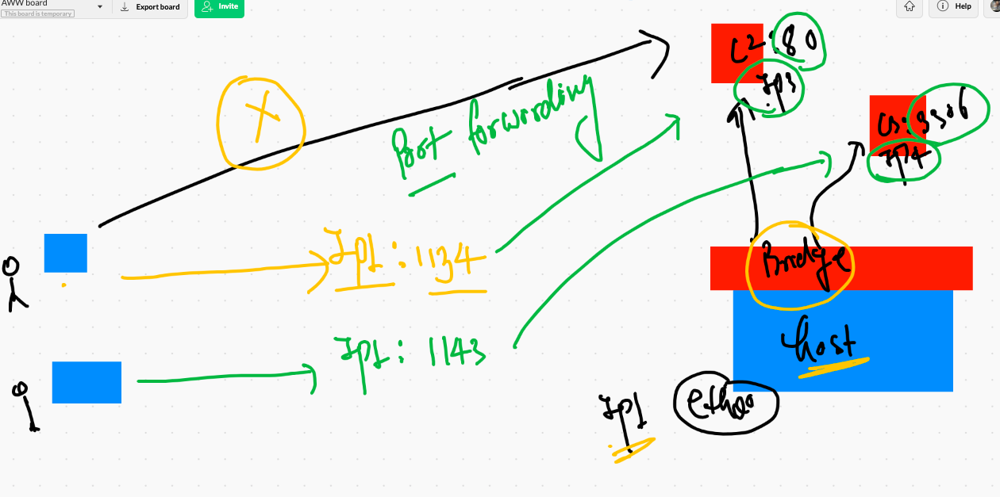


# POrt forwarding 

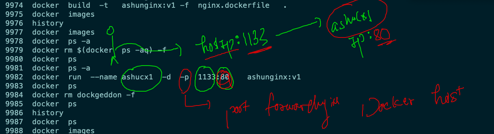


# Storage in Docker 

## storage options 


## storage for container 

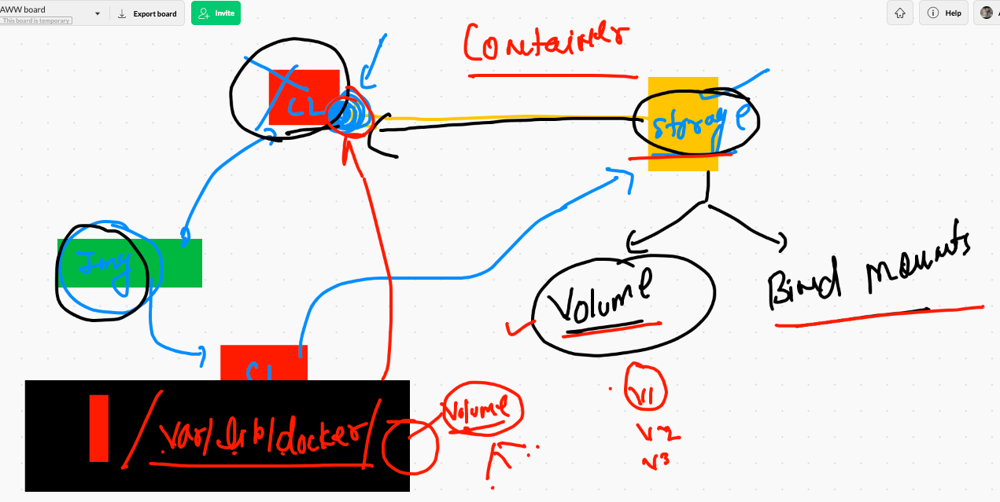

## showing data lost process

```
❯ docker  run -it  --name x1  alpine sh
/ # 
/ # ls
bin    dev    etc    home   lib    media  mnt    opt    proc   root   run    sbin   srv    sys    tmp    usr    var
/ # mkdir  hello world
/ # ls
bin    etc    home   media  opt    root   sbin   sys    usr    world
dev    hello  lib    mnt    proc   run    srv    tmp    var
/ # exit
❯ docker  rm x1
x1

```

## lets play with docker volume 

```
❯ docker  volume  create  ashuvol1
ashuvol1
❯ docker  volume  ls
DRIVER    VOLUME NAME
local     ashuvol1
local     devav1
❯ docker  volume  inspect  ashuvol1
[
    {
        "CreatedAt": "2021-04-20T07:32:54Z",
        "Driver": "local",
        "Labels": {},
        "Mountpoint": "/var/lib/docker/volumes/ashuvol1/_data",
        "Name": "ashuvol1",
        "Options": {},
        "Scope": "local"
    }
]

```

## launching container with volume 

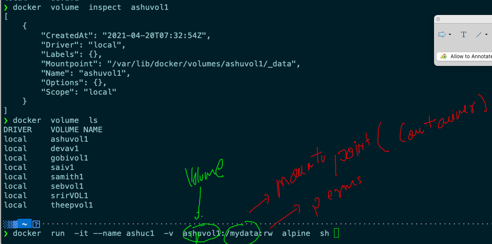

## demo 

```
❯ docker  run  -it --name ashuc1  -v  ashuvol1:/mydata:rw  alpine  sh
/ # 
/ # 
/ # ls
bin     etc     lib     mnt     opt     root    sbin    sys     usr
dev     home    media   mydata  proc    run     srv     tmp     var
/ # cd  /mydata/
/mydata # ls
/mydata # mkdir hello world 
/mydata # ls
hello  world
/mydata # exit
❯ docker rm  ashuc1
ashuc1
❯ docker  volume  ls
DRIVER    VOLUME NAME
local     anwevol1
local     ashuvol1

```

## checking data of volume from engine machine 

```
[root@ip-172-31-71-211 ~]# cd /var/lib/docker/
[root@ip-172-31-71-211 docker]# ls
builder  buildkit  containers  image  network  overlay2  plugins  runtimes  swarm  tmp  trust  volumes
[root@ip-172-31-71-211 docker]# cd  volumes/
[root@ip-172-31-71-211 volumes]# ls
anwevol1  ashuvol1  devav1  geethav1  gobivol1  metadata.db  saiv1  samith1  sebvol1  srirVOL1  swarvol  swarvol1  theepvol1
[root@ip-172-31-71-211 volumes]# cd  ashuvol1/
[root@ip-172-31-71-211 ashuvol1]# ls
_data
[root@ip-172-31-71-211 ashuvol1]# cd _data/
[root@ip-172-31-71-211 _data]# ls
hello  world

```
## access data of volume from another container 

```
❯ docker  run -it --name testashuc1  -v  ashuvol1:/okdata:ro  centos  bash
[root@4c122056cc5a /]# cd  /okdata/
[root@4c122056cc5a okdata]# ls
hello  world
[root@4c122056cc5a okdata]# rmdir hello 
rmdir: failed to remove 'hello': Read-only file system

```


## container with multiple volumes 

```
❯ docker  run -it --name testashuc1  -v  ashuvol1:/okdata:ro -v  ashuvol2:/oo:rw  centos  bash
[root@9ac6bcfcb281 /]# ls
bin  dev  etc  home  lib  lib64  lost+found  media  mnt  okdata  oo  opt  proc	root  run  sbin  srv  sys  tmp	usr  var
[root@9ac6bcfcb281 /]# 

```

## bind mounts 

```
docker  run -it --name ashuxc1  -v  /etc:/myetc:ro   alpine sh 

--

docker run -it --name x1 --mount type=bind,source=/etc,target=/app alpine sh

```

# COmmon issues while deploying containers in production environment 

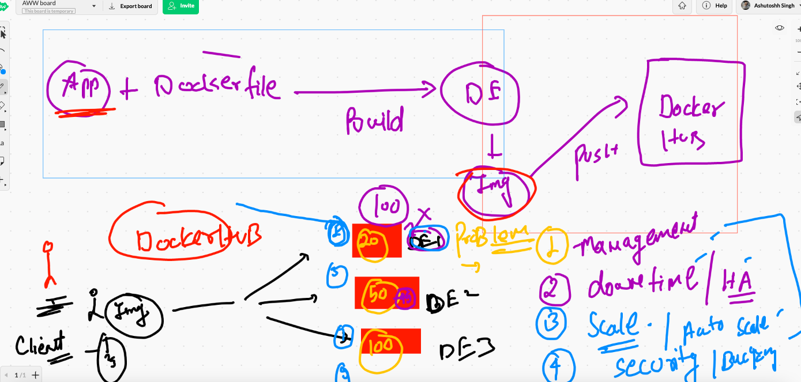

## container orchestration tech 

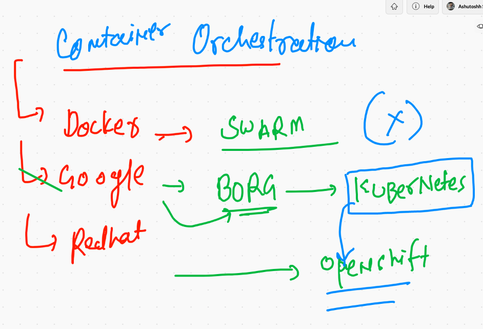

## info about kubernetes 

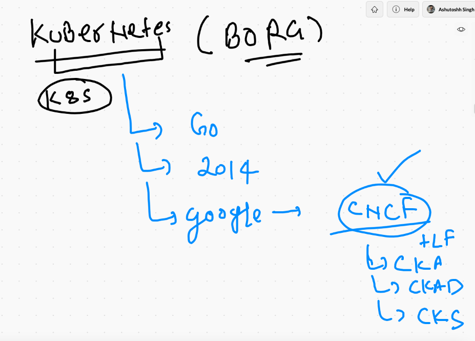

# Exploring k8s architecutre 

## demo 1 


## kube-apiserver 

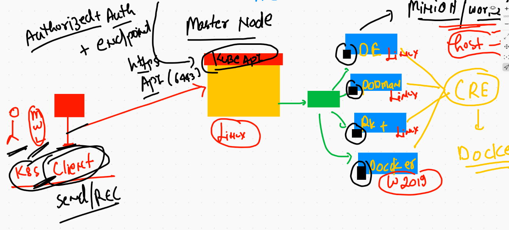

## kube-schedular 

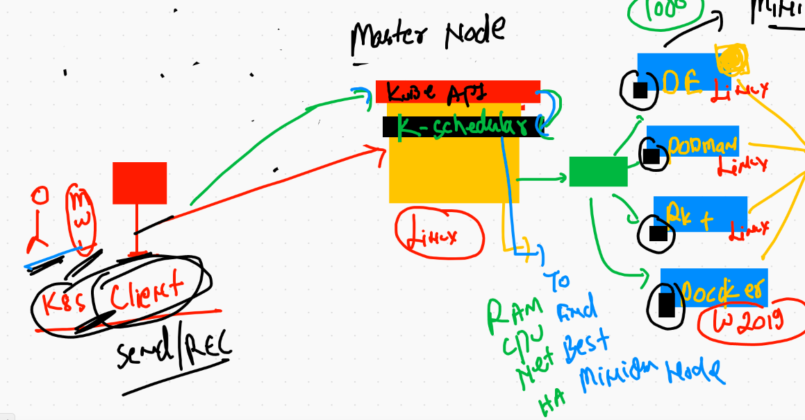

## kube-controller-manager 

### it hold so many components

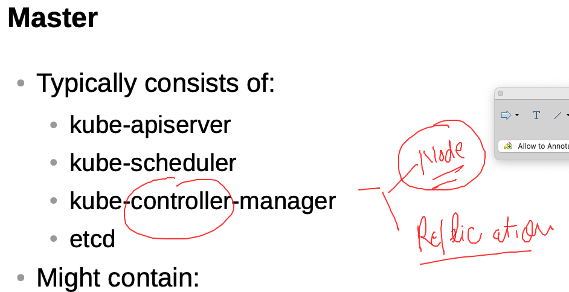

## node controller 

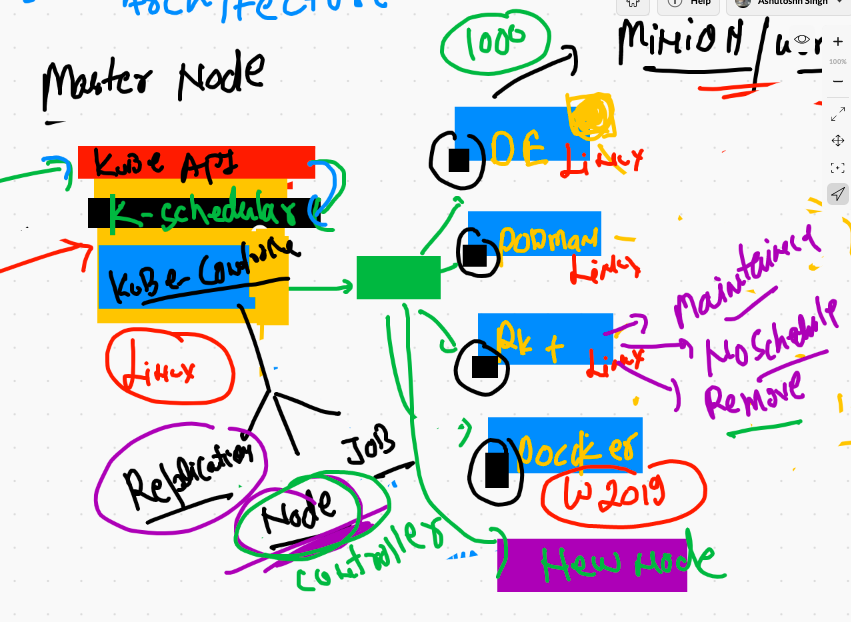

## replication controller 

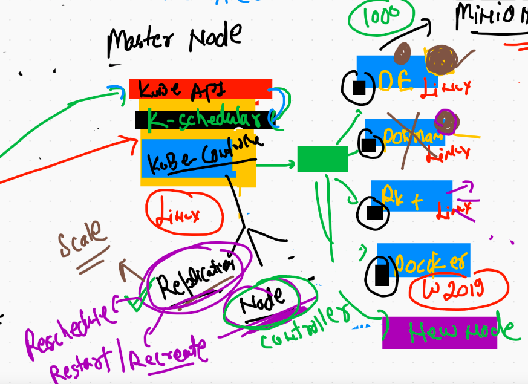

## ETCD -- the brain of k8s 

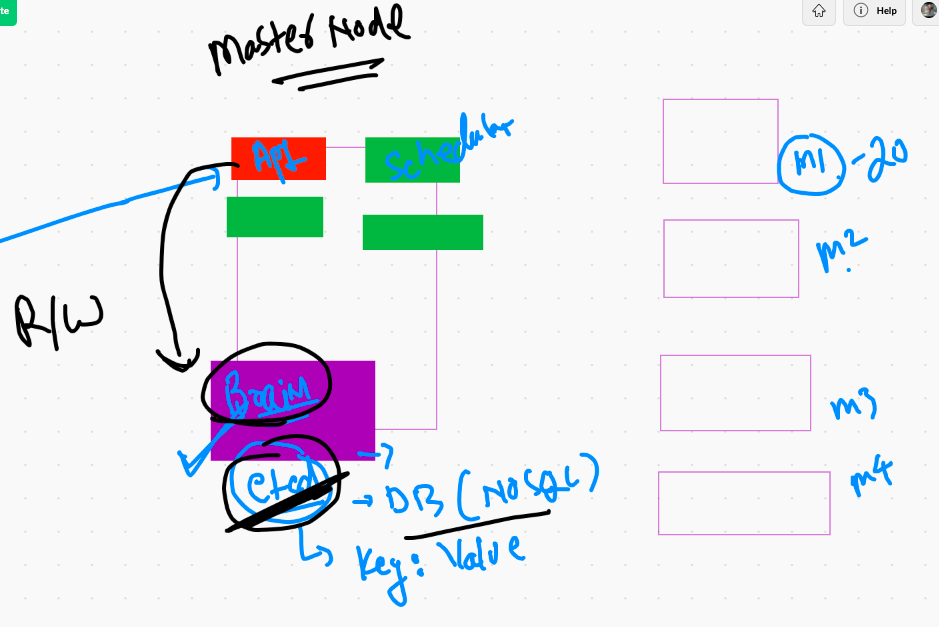


## Networking for containers in k8s 

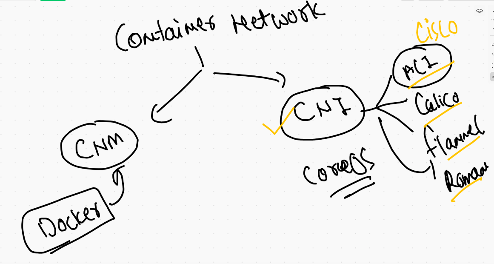

## minion node side -- CNI + kube-proxy 

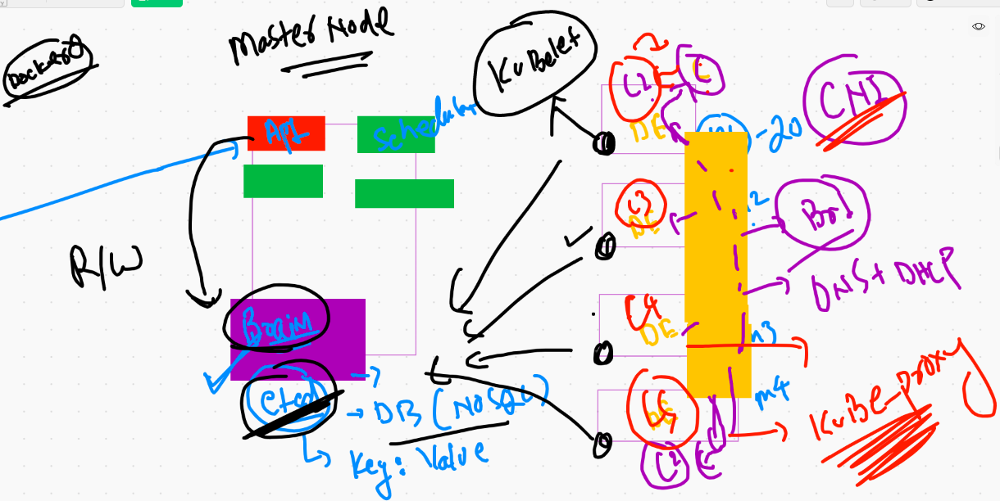


# Kubernetes client installation 

## mac 

```
❯ curl -LO "https://dl.k8s.io/release/$(curl -L -s https://dl.k8s.io/release/stable.txt)/bin/darwin/amd64/kubectl"
  % Total    % Received % Xferd  Average Speed   Time    Time     Time  Current
                                 Dload  Upload   Total   Spent    Left  Speed
100   154  100   154    0     0    364      0 --:--:-- --:--:-- --:--:--   364
100 51.9M  100 51.9M    0     0  5661k      0  0:00:09  0:00:09 --:--:-- 6340k
❯ ls
Applications          Library               VirtualBox VMs        javawebapp            powerlevel10k
Creative Cloud Files  Movies                accc.yml              kubectl
Desktop               Music                 access.yml            macos-terminal-themes
Documents             Pictures              awscli-bundle         minikube-darwin-amd64
Downloads             Public                go                    myconfig
❯ sudo mv -v  kubectl  /usr/local/bin/
Password:
kubectl -> /usr/local/bin/kubectl
❯ sudo chmod +x  /usr/local/bin/kubectl
❯ kubectl  version  --client
Client Version: version.Info{Major:"1", Minor:"21", GitVersion:"v1.21.0", GitCommit:"cb303e613a121a29364f75cc67d3d580833a7479", GitTreeState:"clean", BuildDate:"2021-04-08T16:31:21Z", GoVersion:"go1.16.1", Compiler:"gc", Platform:"darwin/amd64"}


```

## Download token file from k8s master node 

### location of token file 

```
[root@ip-172-31-69-220 ~]# cd  /etc/kubernetes/
[root@ip-172-31-69-220 kubernetes]# ls
admin.conf  controller-manager.conf  kubelet.conf  manifests  pki  scheduler.conf
[root@ip-172-31-69-220 kubernetes]# cat  admin.conf 
apiVersion: v1
clusters:
- cluster:
    certificate-authority-data: LS0tLS1CRUdJTiBDRVJUSUZJQ0FURS0tLS0tCk1JSUM1ekNDQWMrZ0F3SUJBZ0lCQURBTkJna3Foa2lHOXcwQkFRc0ZBREFWTVJNd0VRWURWUVFERXdwcmRXSmwKY201bGRHVnpNQjRYRFRJeE1EUXhOekUxTXpreU1sb1hEVE14TURReE5URTFNemt5TWxvd0ZURVRNQkVHQTFVRQpBeE1LYTNWaVpYSnVaWFJsY3pDQ0FTSXdEUVlKS29aSWh2Y05BUUVCQlFBRGdnRVBBRENDQVFvQ2dnRUJBTU8rCkc5OGNTdy9GZHRHUEsxeU9NK0tuZ3lGb3lXYkJGMWM5V2VEOXhrWTc1RUFwd21ZV3ZJbFpIQmtjUVQ5UGhvYkUKK2NDOUNBRDNMSHBhbEdBVS9DMWNnYWhIaHlGWUkyM0gwSllLbVRLdXNsZGRBT0ZEK0x3d210cEkxbXJCVEhCbgo1ZEYxOG8vMnVzaHZMWnIzc3RyOERzTldab1ZoMlpBcHlzeWlhUGRoa2tZUkJSZTA1cFFNQjhFb1N3a0R6MHZBClR4YVVhNXQ1ZnNncDFZSGNNWnlpQTlRdDVsTERxNmhLbDhHd2RiQ2JKS1FhWXZEeHdUUl
    
  ```
  
### download it 

## checking its connection 

```
❯ kubectl   cluster-info   --kubeconfig  admin.conf
Kubernetes control plane is running at https://54.227.223.108:6443
CoreDNS is running at https://54.227.223.108:6443/api/v1/namespaces/kube-system/services/kube-dns:dns/proxy

To further debug and diagnose cluster problems, use 'kubectl cluster-info dump'.
❯ kubectl   get  nodes    --kubeconfig  admin.conf
NAME                            STATUS   ROLES                  AGE     VERSION
ip-172-31-69-220.ec2.internal   Ready    control-plane,master   2d19h   v1.21.0
ip-172-31-70-124.ec2.internal   Ready    <none>                 2d19h   v1.21.0
ip-172-31-75-3.ec2.internal     Ready    <none>                 2d19h   v1.21.0


```

## setting admin.conf permanently 

```
❯ cp -v  ~/Desktop/admin.conf  ~/.kube/config
/Users/fire/Desktop/admin.conf -> /Users/fire/.kube/config
❯ cd
❯ 
❯ kubectl   get  nodes
NAME                            STATUS   ROLES                  AGE     VERSION
ip-172-31-69-220.ec2.internal   Ready    control-plane,master   2d19h   v1.21.0
ip-172-31-70-124.ec2.internal   Ready    <none>                 2d19h   v1.21.0
ip-172-31-75-3.ec2.internal     Ready    <none>                 2d19h   v1.21.0
❯ kubectl   version
Client Version: version.Info{Major:"1", Minor:"21", GitVersion:"v1.21.0", GitCommit:"cb303e613a121a29364f75cc67d3d580833a7479", GitTreeState:"clean", BuildDate:"2021-04-08T16:31:21Z", GoVersion:"go1.16.1", Compiler:"gc", Platform:"darwin/amd64"}
Server Version: version.Info{Major:"1", Minor:"21", GitVersion:"v1.21.0", GitCommit:"cb303e613a121a29364f75cc67d3d580833a7479", GitTreeState:"clean", BuildDate:"2021-04-08T16:25:06Z", GoVersion:"go1.16.1", Compiler:"gc", Platform:"linux/amd64"}
❯ kubectl  cluster-info
Kubernetes control plane is running at https://54.227.223.108:6443
CoreDNS is running at https://54.227.223.108:6443/api/v1/namespaces/kube-system/services/kube-dns:dns/proxy

To further debug and diagnose cluster problems, use 'kubectl cluster-info dump'.

```


