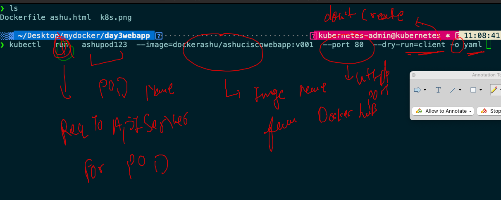
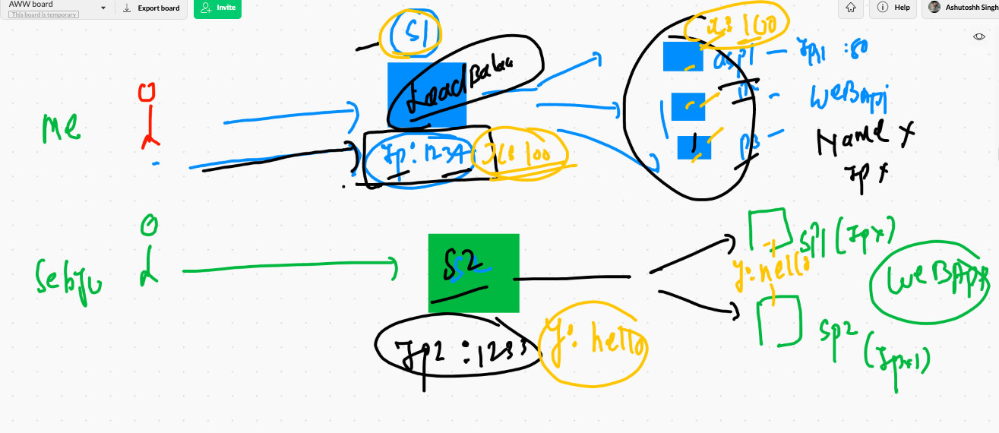

# recap of day 1 & day 2


# step by step webapplication deployment in k8s

## step 1 building webapp with apache httpd selection 


## step 2 designing dockerfile 

```
❯ cd  Desktop/mydocker/day3webapp
❯ ls
Dockerfile ashu.html  k8s.png
❯ docker  context  ls
NAME                TYPE                DESCRIPTION                               DOCKER ENDPOINT               KUBERNETES ENDPOINT                     ORCHESTRATOR
ashuawsDE1 *        moby                                                          tcp://34.193.110.49:2375                                              
default             moby                Current DOCKER_HOST based configuration   unix:///var/run/docker.sock   https://54.227.223.108:6443 (default)   swarm
❯ docker  build  -t  dockerashu/ashuciscowebapp:v001  .
Sending build context to Docker daemon  134.1kB
Step 1/7 : FROM centos
 ---> 300e315adb2f
Step 2/7 : MAINTAINER  ashutoshh@linux.com
 ---> Using cache
 ---> 39c5c00ce2f2
Step 3/7 : RUN yum install httpd -y
 ---> Running in 46a37b53299f
CentOS Linux 8 - AppStream                       16 MB/s | 6.3 MB     00:00    
CentOS Linux 8 - BaseOS                         9.0 MB/s | 2.3 MB     00:00    
CentOS Linux 8 - Extras                          48 kB/s | 9.6 kB     00:00    
Dependencies resolved.
================================================================================
 Package           Arch   Version                               Repo       Size
================================================================================
Installing:
 httpd             x86_64 2.4.37-30.module_el8.3.0+561+97fdbbcc appstream 1.7 M
Installing dependencies:
 apr               x86_64 1.6.3-11.el8                          appstream 125 k
 apr-util          x86_64 1.6.1-6.el8                           appstream 105 k
 brotli            x86_64 1.0.6-2.el8                           baseos    322 k
 centos-logos-httpd
                   noarch 80.5-2.el8                            baseos     24 k
 httpd-filesystem  noarch 2.4.37-30.module_el8.3.0+561+97fdbbcc appstream  37 k
 httpd-tools       x86_64 2.4.37-30.module_el8.3.0+561+97fdbbcc appstream 104 k
 mailcap           noarch 2.1.48-3.el8                          baseos     39 k
 mod_http2         x86_64 1.15.7-2.module_el8.3.0+477+498bb568  appstream 154 k
Installing weak dependencies:
 apr-util-bdb      x86_64 1.6.1-6.el8                           appstream  25 k
 apr-util-openssl  x86_64 1.6.1-6.el8                           appstream  27 k
Enabling module streams:
 httpd                    2.4                                                  

Transaction Summary
================================================================================
Install  11 Packages

Total download size: 2.6 M
Installed size: 7.5 M
Downloading Packages:
(1/11): apr-util-1.6.1-6.el8.x86_64.rpm         7.0 MB/s | 105 kB     00:00    
(2/11): apr-util-bdb-1.6.1-6.el8.x86_64.rpm     1.5 MB/s |  25 kB     00:00    
(3/11): apr-1.6.3-11.el8.x86_64.rpm             6.7 MB/s | 125 kB     00:00    
(4/11): apr-util-openssl-1.6.1-6.el8.x86_64.rpm 7.7 MB/s |  27 kB     00:00    
(5/11): httpd-filesystem-2.4.37-30.module_el8.3 8.0 MB/s |  37 kB     00:00    
(6/11): mod_http2-1.15.7-2.module_el8.3.0+477+4  22 MB/s | 154 kB     00:00    
(7/11): httpd-tools-2.4.37-30.module_el8.3.0+56 9.4 MB/s | 104 kB     00:00    
(8/11): centos-logos-httpd-80.5-2.el8.noarch.rp 6.4 MB/s |  24 kB     00:00    
(9/11): brotli-1.0.6-2.el8.x86_64.rpm            29 MB/s | 322 kB     00:00    
(10/11): mailcap-2.1.48-3.el8.noarch.rpm        5.8 MB/s |  39 kB     00:00    
(11/11): httpd-2.4.37-30.module_el8.3.0+561+97f  42 MB/s | 1.7 MB     00:00    
--------------------------------------------------------------------------------
Total                                            15 MB/s | 2.6 MB     00:00     
warning: /var/cache/dnf/appstream-02e86d1c976ab532/packages/apr-1.6.3-11.el8.x86_64.rpm: Header V3 RSA/SHA256 Signature, key ID 8483c65d: NOKEY
CentOS Linux 8 - AppStream                      1.6 MB/s | 1.6 kB     00:00    
Importing GPG key 0x8483C65D:
 Userid     : "CentOS (CentOS Official Signing Key) <security@centos.org>"
 Fingerprint: 99DB 70FA E1D7 CE22 7FB6 4882 05B5 55B3 8483 C65D
 From       : /etc/pki/rpm-gpg/RPM-GPG-KEY-centosofficial
Key imported successfully
Running transaction check
Transaction check succeeded.
Running transaction test
Transaction test succeeded.
Running transaction
  Preparing        :                                                        1/1 
  Installing       : apr-1.6.3-11.el8.x86_64                               1/11 
  Running scriptlet: apr-1.6.3-11.el8.x86_64                               1/11 
  Installing       : apr-util-bdb-1.6.1-6.el8.x86_64                       2/11 
  Installing       : apr-util-openssl-1.6.1-6.el8.x86_64                   3/11 
  Installing       : apr-util-1.6.1-6.el8.x86_64                           4/11 
  Running scriptlet: apr-util-1.6.1-6.el8.x86_64                           4/11 
  Installing       : httpd-tools-2.4.37-30.module_el8.3.0+561+97fdbbcc.    5/11 
  Installing       : mailcap-2.1.48-3.el8.noarch                           6/11 
  Installing       : centos-logos-httpd-80.5-2.el8.noarch                  7/11 
  Installing       : brotli-1.0.6-2.el8.x86_64                             8/11 
  Running scriptlet: httpd-filesystem-2.4.37-30.module_el8.3.0+561+97fd    9/11 
  Installing       : httpd-filesystem-2.4.37-30.module_el8.3.0+561+97fd    9/11 
  Installing       : mod_http2-1.15.7-2.module_el8.3.0+477+498bb568.x86   10/11 
  Installing       : httpd-2.4.37-30.module_el8.3.0+561+97fdbbcc.x86_64   11/11 
  Running scriptlet: httpd-2.4.37-30.module_el8.3.0+561+97fdbbcc.x86_64   11/11 
  Verifying        : apr-1.6.3-11.el8.x86_64                               1/11 
  Verifying        : apr-util-1.6.1-6.el8.x86_64                           2/11 
  Verifying        : apr-util-bdb-1.6.1-6.el8.x86_64                       3/11 
  Verifying        : apr-util-openssl-1
  
  ```
  
  
  ## step 3 pushing image to docker hub 
  
  ```
  ❯ docker  login
Login with your Docker ID to push and pull images from Docker Hub. If you don't have a Docker ID, head over to https://hub.docker.com to create one.
Username: dockerashu
Password: 
Login Succeeded
❯ docker  push  dockerashu/ashuciscowebapp:v001
The push refers to repository [docker.io/dockerashu/ashuciscowebapp]
facce407b7a4: Pushed 
234e1c677ebf: Pushed 
60aea6bbe6c5: Pushed 
2653d992f4ef: Mounted from library/centos 
v001: digest: sha256:ebe6468ef5dbea83e57131b5db926d017ebc5c527e0b9582dc5eb7bf51321ad8 size: 1158
❯ docker  logout
Removing login credentials for https://index.docker.io/v1/

```

## creating pod yaml file automatically 



## storing yaml in file 

```
❯ kubectl   run   ashupod123  --image=dockerashu/ashuciscowebapp:v001  --port 80  --dry-run=client -o yaml
apiVersion: v1
kind: Pod
metadata:
  creationTimestamp: null
  labels:
    run: ashupod123
  name: ashupod123
spec:
  containers:
  - image: dockerashu/ashuciscowebapp:v001
    name: ashupod123
    ports:
    - containerPort: 80
    resources: {}
  dnsPolicy: ClusterFirst
  restartPolicy: Always
status: {}
❯ kubectl   run   ashupod123  --image=dockerashu/ashuciscowebapp:v001  --port 80  --dry-run=client -o yaml  >webapp.yml

```

## Deployment of yaml file in k8s 

```
 kubectl  apply -f  webapp.yml
pod/ashupod123 created
❯ kubectl   get   pods
NAME         READY   STATUS    RESTARTS   AGE
anwepod123   1/1     Running   0          3s
ashupod123   1/1     Running   0          12s
pox1         1/1     Running   0          130m

```

## pod as written as 

```
4  kubectl   get   pods
10025  kubectl   get   po
10026  kubectl   get   pod

```

## checking where pod got schedule by kube-schedular 

```
❯ kubectl   get   po   ashupod123   -o wide
NAME         READY   STATUS    RESTARTS   AGE     IP               NODE                          NOMINATED NODE   READINESS GATES
ashupod123   1/1     Running   0          3m58s   192.168.40.146   ip-172-31-75-3.ec2.internal   <none>           <none>

```

## checking all pod details 

```
 kubectl   get   po      -o wide
NAME          READY   STATUS    RESTARTS   AGE     IP               NODE                            NOMINATED NODE   READINESS GATES
anwepod123    1/1     Running   0          5m17s   192.168.40.147   ip-172-31-75-3.ec2.internal     <none>           <none>
ashupod123    1/1     Running   0          5m26s   192.168.40.146   ip-172-31-75-3.ec2.internal     <none>           <none>
devupod123    1/1     Running   0          5m4s    192.168.40.149   ip-172-31-75-3.ec2.internal     <none>           <none>
geethapod2    1/1     Running   0          5m11s   192.168.194.21   ip-172-31-70-124.ec2.internal   <none>           <none>
gobipod123    1/1     Running   0          4m2s    192.168.194.24   ip-172-31-70-124.ec2.internal   <none>           <none>
nrupanag      1/1     Running   0          4m30s   192.168.40.151   ip-172-31-75-3.ec2.internal     <none>           <none>
pox1          1/1     Running   0          135m    192.168.194.17   ip-172-31-70-124.ec2.intern

```

## container info and so much other details you can check in pod 

```
❯ kubectl   describe  pod  ashupod123
Name:         ashupod123
Namespace:    default
Priority:     0
Node:         ip-172-31-75-3.ec2.internal/172.31.75.3
Start Time:   Wed, 21 Apr 2021 11:21:44 +0530
Labels:       run=ashupod123
Annotations:  cni.projectcalico.org/podIP: 192.168.40.146/32
              cni.projectcalico.org/podIPs: 192.168.40.146/32
Status:       Running
IP:           192.168.40.146
IPs:
  IP:  192.168.40.146
Containers:
  ashupod123:
    Container ID:   docker://06ae6f453cc6500369379d1aa5191209d8706d7e75765ad87efb5438e027a39f
    Image:          dockerashu/ashuciscowebapp:v001
    Image ID:       docker-pullable://dockerashu/ashuciscowebapp@sha256:ebe6468ef5dbea83e57131b5db926d017ebc5c527e0b9582dc5eb7bf51321ad8
    Port:           80/TCP
    Host Port:      0/TCP
    State:          Running
      Started:      Wed, 21 Apr 2021 11:21:53 +0530
    Ready:          True


```

# Introduction to service in k8s for POD networking 



### service will use label of pod to find pod info 
## checking label of pods 

```
❯ kubectl  get  po   ashupod123  --show-labels
NAME         READY   STATUS    RESTARTS   AGE   LABELS
ashupod123   1/1     Running   1          40m   run=ashupod123
❯ kubectl  get  po   --show-labels
NAME          READY   STATUS    RESTARTS   AGE    LABELS
anwepod123    1/1     Running   0          40m    run=anwepod123
ashupod123    1/1     Running   1          41m    run=ashupod123
devupod123    1/1     Running   0          40m    run=devupod123
geethapod2    1/1     Running   0          40m    run=geethapod2
gobipod123    1/1     Running   0          39m    run=gobipod123

```

## service in one glance 


## type of service 


## nodeport service 


## creating nodeport service 


```
❯ kubectl   create   service   nodeport  ashus1  --tcp  1234:80  --dry-run=client  -o yaml
apiVersion: v1
kind: Service
metadata:
  creationTimestamp: null
  labels:
    app: ashus1
  name: ashus1
spec:
  ports:
  - name: 1234-80
    port: 1234
    protocol: TCP
    targetPort: 80
  selector:
    app: ashus1
  type: NodePort
status:
  loadBalancer: {}
❯ kubectl   create   service   nodeport  ashus1  --tcp  1234:80  --dry-run=client  -o yaml   >ashunodeport.yaml

```

## understanding selector in nodeport service


## deploying nodeport service 


## checking service  short form 

```
❯ kubectl   get   svc
NAME         TYPE        CLUSTER-IP       EXTERNAL-IP   PORT(S)          AGE
anwes1       NodePort    10.105.101.194   <none>        1234:31085/TCP   118m
ashus1       NodePort    10.97.215.220    <none>        1234:32397/TCP   119m
devas1       NodePort    10.97.40.11      <none>        1234:31248/TCP   111m
geetha1      NodePort    10.105.113.74    <none>        1234:30106/TCP   104m
gobis1       NodePort    10.99.200.67     <none>        1234:32394/TCP   111m

```

## deleting pod & service 

```
❯ kubectl delete pod ashupod123
pod "ashupod123" deleted
❯ kubectl delete service  ashus1
service "ashus1" deleted

```

## deleting pod and service 

```
❯ kubectl  delete all --all
pod "anwepod123" deleted
pod "ashupod123" deleted
pod "devupod123" deleted
pod "geethapod2" deleted
pod "gobipod123" deleted
pod "nrupanag" deleted
pod "pox1" deleted
pod "pox2" deleted
pod "pox3" deleted
pod "pox4" deleted
pod "pox5" deleted
pod "pracpod123" deleted
pod "saipod123" deleted
pod "sampod123" deleted
pod "sebpod123" deleted
pod "srirpod123" deleted
pod "swarnapod1" deleted
pod "theeppod123" deleted
service "anwes1" deleted
service "ashus1" deleted
service "devas1" deleted
service "geetha1" deleted
service "gobis1" deleted
service "kubernetes" deleted

```

## alpine pod 

```
10082  kubectl   run    ashupodx1  --image=alpine  --dry-run=client -o yaml 
10083  kubectl   run    ashupodx1  --image=alpine  --dry-run=client -o json 
❯ 
❯ 
❯ kubectl   run    ashupodx1  --image=alpine  --dry-run=client -o yaml >alp.yaml

```

## Best practise to deploy any application in k8s 


# creating deployment 

```
❯ kubectl  create  deployment  ashudep1  --image=dockerashu/ashuciscowebapp:v001  --dry-run=client -o yaml  >ashudep.yml
❯ kubectl   create  service nodeport   ashusvc2  --tcp  2233:80  --dry-run=client -o yaml   >>ashudep.yml

```

## under deployment the section that will be used for pod creation purpose 


## deployment of deployment and services

```
❯ kubectl  apply  -f   ashudep.yml
deployment.apps/ashudep1 created
service/ashusvc2 created
❯ kubectl   get  deployment
NAME             READY   UP-TO-DATE   AVAILABLE   AGE
ashudep1         1/1     1            1           14s
pracdep1         1/1     1            1           9s
saidep1          1/1     1            1           4s
sebdep1          1/1     1            1           6s
swardeploymet1   1/1     1            1           47s
❯ kubectl   get  deploy
NAME             READY   UP-TO-DATE   AVAILABLE   AGE
ashudep1         1/1     1            1           18s
pracdep1         1/1     1            1           13s
saidep1          1/1     1            1           8s
sebdep1          1/1     1            1           10s
srirdeplyment1   1/1     1            1           4s
swardeploymet1   1/1     1            1           51s
❯ kubectl   get  svc
NAME             TYPE        CLUSTER-IP       EXTERNAL-IP   PORT(S)          AGE
ashusvc2         NodePort    10.102.160.255   <none>        2233:30454/TCP   27s
geethssvc2       NodePort    10.110.165.188   <none>        2233:30644/TCP   10s
kubernetes       ClusterIP   10.96.0.1        <none>        443/TCP          14m
pracsvc2         NodePort    10.103.130.131   <none>        2233:31685/TCP   21s
saisv2           NodePort    10.101.29.217    <none>        2233:31165/TCP   17s
sebsvc2          NodePort    10.98.77.185     <none>        2233:31116/TCP   18s
srirsrv1         NodePort    10.104.176.69    <none>        2222:31066/TCP   10s
swarnanodeport   NodePort    10.97.132.242    <none>        2233:32227/TCP   59s

```

## scaling pod with yaml file 


## upgrade app version 

```
10133  docker  build  -t  dockerashu/ashuciscowebapp:v002  .
10134  docker login 
10135  docker push dockerashu/ashuciscowebapp:v002 
10136  docker  logout 

```

# k8s cluster setup 


## all type of k8s cluster setup 


## context idea in K8s 

```
❯ kubectl   get  nodes
NAME       STATUS   ROLES                  AGE   VERSION
minikube   Ready    control-plane,master   42d   v1.20.2
❯ kubectl  config get-contexts
CURRENT   NAME                          CLUSTER      AUTHINFO           NAMESPACE
          kubernetes-admin@kubernetes   kubernetes   kubernetes-admin   
*         minikube                      minikube     minikube           default
❯ kubectl   config  use-context  kubernetes-admin@kubernetes
Switched to context "kubernetes-admin@kubernetes".
❯ kubectl  config get-contexts
CURRENT   NAME                          CLUSTER      AUTHINFO           NAMESPACE
*         kubernetes-admin@kubernetes   kubernetes   kubernetes-admin   
          minikube                      minikube     minikube           default
❯ kubectl   get  nodes
NAME                            STATUS   ROLES                  AGE     VERSION
ip-172-31-69-220.ec2.internal   Ready    control-plane,master   3d20h   v1.21.0
ip-172-31-70-124.ec2.internal   Ready    <none>                 3d20h   v1.21.0
ip-172-31-75-3.ec2.internal     Ready    <none>                 3d20h   v1.21.0

```


