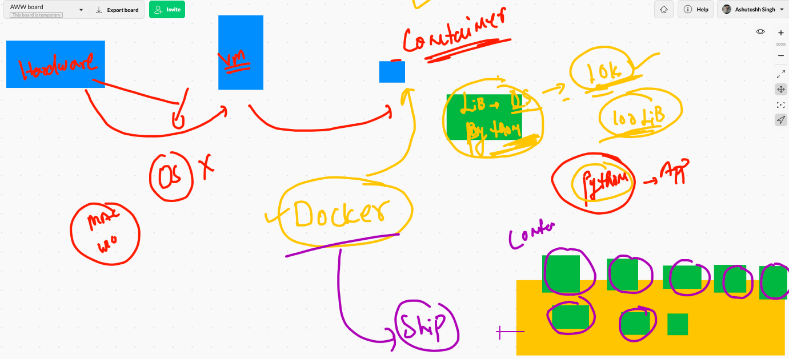

# Docker COntainer getting started. 

## docker for everyone 


# application deployment model history 

## bare-metal / hardware based app depoyment 


## virtualization based app depoyment 


## Problem with VM's


# COntainers all the way 



# Introdution to cRE


# Introduction to DOcker 


## Installation of Docker in Mac/W10 using docker Desktop 

# Docker architecture 


## Installing Docker engine in LInux server (amazon linux / centos / rhel / fedora )

```
[root@ip-172-31-71-211 ~]# yum  install  docker  
Failed to set locale, defaulting to C
Loaded plugins: extras_suggestions, langpacks, priorities, update-motd
amzn2-core                                                                                    | 3.7 kB  00:00:00     
Resolving Dependencies
--> Running transaction check
---> Package docker.x86_64 0:19.03.13ce-1.amzn2 will be installed
--> Processing Dependency: runc >= 1.0.0 for package: docker-19.03.13ce-1.amzn2.x86_64
--> Processing Dependency: containerd >= 1.3.2 for package: docker-19.03.13ce-1.amzn2.x86_64
--> Processing Dependency: pigz for package: docker-19.03.13ce-1.amzn2.x86_64
--> Processing Dependency: libcgroup for package: docker-19.03.13ce-1.amzn2.x86_64
--> Running transaction check
---> Package containerd.x86_64 0:1.4.4-1.amzn2 will be installed
---> Package libcgroup.x86_64 0:0.41-21.amzn2 will be installed
---> Package pigz.x86_64 0:2.3.4-1.amzn2.0.1 will be installed
---> Package runc.x86_64 0:1.0.0-0.1.20210225.git12644e6.amzn2 will be installed
--> Finished Dependency Resolution

Dependencies Resolved


```

## COnfigure Docker engine as TCP socket 

```
[root@ip-172-31-71-211 ~]# cd  /etc/sysconfig/
[root@ip-172-31-71-211 sysconfig]# ls
acpid       console         grub        man-db           nfs            rpcbind    sshd
atd         cpupower        i18n        modules          raid-check     rsyncd     sysstat
authconfig  crond           init        netconsole       rdisc          rsyslog    sysstat.ioconf
chronyd     docker          irqbalance  network          readonly-root  run-parts
clock       docker-storage  keyboard    network-scripts  rpc-rquotad    selinux
[root@ip-172-31-71-211 sysconfig]# vim docker
[root@ip-172-31-71-211 sysconfig]# cat  docker
# The max number of open files for the daemon itself, and all
# running containers.  The default value of 1048576 mirrors the value
# used by the systemd service unit.
DAEMON_MAXFILES=1048576

# Additional startup options for the Docker daemon, for example:
# OPTIONS="--ip-forward=true --iptables=true"
# By default we limit the number of open files per container
OPTIONS="--default-ulimit nofile=1024:4096  -H tcp://0.0.0.0:2375"
# enable docker  tcp socket 

# How many seconds the sysvinit script waits for the pidfile to appear
# when starting the daemon.
DAEMON_PIDFILE_TIMEOUT=10

```

## start docker server / engine 

```
[root@ip-172-31-71-211 sysconfig]# systemctl  start  docker 
[root@ip-172-31-71-211 sysconfig]# systemctl enale  docker 
Unknown operation 'enale'.
[root@ip-172-31-71-211 sysconfig]# systemctl enable  docker 
Created symlink from /etc/systemd/system/multi-user.target.wants/docker.service to /usr/lib/systemd/system/docker.service.
[root@ip-172-31-71-211 sysconfig]# netstat -nlpt
Active Internet connections (only servers)
Proto Recv-Q Send-Q Local Address           Foreign Address         State       PID/Program name    
tcp        0      0 0.0.0.0:111             0.0.0.0:*               LISTEN      1827/rpcbind        
tcp        0      0 0.0.0.0:22              0.0.0.0:*               LISTEN      2581/sshd           
tcp        0      0 127.0.0.1:43225         0.0.0.0:*               LISTEN      32432/containerd    
tcp        0      0 127.0.0.1:25            0.0.0.0:*               LISTEN      2314/master         
tcp6       0      0 :::2375                 :::*                    LISTEN      32484/dockerd   

```


# Docker Desktop explanation 


## Docker context  creation & usage 

```
10014  docker  context   create  ashuawsDE1  --docker  "host=tcp://34.193.110.49:2375"  
10015  docker  context   ls
❯ docker  context   ls
NAME                TYPE                DESCRIPTION                               DOCKER ENDPOINT               KUBERNETES ENDPOINT                  ORCHESTRATOR
ashuawsDE1          moby                                                          tcp://34.193.110.49:2375                                           
default *           moby                Current DOCKER_HOST based configuration   unix:///var/run/docker.sock   https://3.218.201.220:6443 (ashux)   swarm
❯ docker  context   use  ashuawsDE1
ashuawsDE1
❯ docker  context   ls
NAME                TYPE                DESCRIPTION                               DOCKER ENDPOINT               KUBERNETES ENDPOINT                  ORCHESTRATOR
ashuawsDE1 *        moby                                                          tcp://34.193.110.49:2375                                           
default             moby                Current DOCKER_HOST based configuration   unix:///var/run/docker.sock   https://3.218.201.220:6443 (ashux)   swarm


```


## DOcker client operations 

### searching image on docker hub 

```
❯ docker  search  python
NAME                             DESCRIPTION                                     STARS     OFFICIAL   AUTOMATED
python                           Python is an interpreted, interactive, objec…   6065      [OK]       
django                           Django is a free web application framework, …   1067      [OK]       
pypy                             PyPy is a fast, compliant alternative implem…   270       [OK]       
nikolaik/python-nodejs           Python with Node.js                             71                   [OK]
joyzoursky/python-chromedriver   Python with Chromedriver, for running automa…   58                   [OK]
arm32v7/python                   Python is an interpreted, interactive, objec…   57                   
circleci/python                  Python is an interpreted, interactive, objec…   42                   
centos/python-35-centos7         Platform for building and running Python 3.5…   39                   
centos/python-36-centos7         Platform for building and running Python 3.6…   31                   
hylang                           Hy is a Lisp dialect that translates express…   30        [OK]       
arm64v8/python                   Python is an interpreted, interactive, objec…   24                   
centos/python-27-centos7         Platform for building and running Python 2.7…   17                   
bitnami/python                   Bitnami Python Docker Image                     9                    [OK]
publicisworldwide/python-conda   Basic Python environments with Conda.           6                    [OK]
d3fk/python_in_bottle            Simple python:alpine completed by Bottle+Req…   5                    [OK]
dockershelf/python               Repository for docker images of Python. Test…   5                    [OK]
clearlinux/python                Python programming interpreted language with…   3                    
i386/python                      Python is an interpreted, interactive, objec…   3                    
komand/python-plugin             DEPRECATED: Komand Python SDK                   2                    [OK]
centos/python-34-centos7         Platform for building and running Python 3.4…   2                    
ppc64le/python                   Python is an interpreted, interactive, objec…   2                    
amd64/python                     Python is an interpreted, interactive, objec…   1                    
saagie/python                    Repo for python jobs                            0                    
s390x/python                     Python is an interpreted, interactive, objec…   0                    
ccitest/python                   CircleCI test images for Python                 0                    [OK]

░▒▓ ~ ······································································································ 12:49:29 PM ▓▒░─╮
❯                                                                                                                             ─╯


❯ docker  search  java
NAME                                     DESCRIPTION                                     STARS     OFFICIAL   AUTOMATED
node                                     Node.js is a JavaScript-based platform for s…   9941      [OK]       
tomcat                                   Apache Tomcat is an open source implementati…   3001      [OK]       
openjdk                                  OpenJDK is an open-source implementation of …   2694      [OK]       
java                                     Java is a concurrent, class-based, and objec…   1976      [OK]       
ghost                                    Ghost is a free and open source blogging pla…   1350      [OK]       
couchdb                                  CouchDB is a database that uses JSON for doc…   398       [OK]       
jetty                                    Jetty provides a Web server and javax.servle…   358       [OK]       
groovy                                   Apache Groovy is a multi-faceted language fo…   106       [OK]       
lwieske/java-8                           Oracle Java 8 Container - Full + Slim - Base…   49                   [OK]
nimmis/java-centos                       This is docker images of CentOS 7 with diffe…   42                   [OK]
fabric8/java-jboss-openjdk8-jdk          Fabric8 Java Base Image (JBoss, OpenJDK 8)      29                   [OK]
timbru31/java-node                       OpenJDK JRE or JDK (8 or 11) with Node.js 12…   15                   [OK]
cloudbees/java-build-tools               Docker image with commonly used tools to bui…   15                   [OK]
frekele/java                             docker run --rm --name java frekele/java        12                   [OK]
blacklabelops/java                       Java Base Images.                               8                    [OK]
bitnami/java                             Bitnami Java Docker Image                       6                    [OK]
rightctrl/java                           Oracle Java                                     3                    [OK]
cfje/java-test-applications              Java Test Applications CI Image                 2                    
jelastic/javaengine                      An image of the Java Engine server maintaine…   1                    
cfje/java-resource                       Java Concourse Resource                         1                    
buildo/java8-wkhtmltopdf                 Java 8 + wkhtmltopdf                            1                    [OK]
cfje/java-buildpack                      Java Buildpack CI Image                         1                    
cfje/java-buildpack-dependency-builder   Java Buildpack Dependencies Builder Image       0                    
thingswise/java-docker                   Java + dcd                                      0                    [OK]
cfje/java-buildpack-memory-calculator    Java Buildpack Memory Calculator CI Image       0                    

░▒▓ ~ ······································································································ 12:52:20 PM ▓▒░─╮
❯ docker  search  java                                                                                                        ─╯


❯ docker  search  ashutoshh
NAME                           DESCRIPTION   STARS     OFFICIAL   AUTOMATED
ashutoshh/cent6ssh_http                      1                    
ashutoshh/centos6ssh                         0                    
ashutoshh/24dec2014                          0                    
ashutoshh/centos7systemd                     0                    
ashutoshh/apache2.4                          0                    
ashutoshh/yureka                             0                    
dockerashu/ashutoshheyfebapp                 0                    
ashutoshh/dd2527ea18bd                       0                    
ashutoshh/ocphp                              0                    
dockerashu/ashutoshh                         0                    
❯ docker  search  dockerashu
NAME                           DESCRIPTION   STARS     OFFICIAL   AUTOMATED
dockerashu/oracleweb                         0                    
dockerashu/nginx                             0                    
dockerashu/ckad                              0                    
dockerashu/watch                             0                    
dockerashu/microsoftapp                      0                    
dockerashu/eyappday5                         0                    
dockerashu/ashuwebapp                        0                    
dockerashu/ashutoshheyfebapp                 0                    
dockerashu/jan2021                           0                    
dockerashu/httpd                             0                    
dockerashu/day4webapp                        0                    
dockerashu/ashuwebadhocapp                   0                    
dockerashu/april2020                         0                    
dockerashu/fedora                            0    

```

## Downloading image from docker hub 

```
❯ docker   images
REPOSITORY   TAG       IMAGE ID   CREATED   SIZE
❯ docker   pull  python
Using default tag: latest
latest: Pulling from library/python
bd8f6a7501cc: Pull complete 
44718e6d535d: Pull complete 
efe9738af0cb: Pull complete 
f37aabde37b8: Pull complete 
3923d444ed05: Pull complete 
1ecef690e281: Pull complete 
0649c5bd9851: Pull complete 
d7a9fa72f192: Pull complete 
d1460947be43: Pull complete 
Digest: sha256:07c51c65ab9c1a156a1fb51eff3ec04feff7b85b2acb7d6cc65148b218d67402
Status: Downloaded newer image for python:latest
docker.io/library/python:latest
❯ docker   images
REPOSITORY   TAG       IMAGE ID       CREATED      SIZE
python       latest    49e3c70d884f   8 days ago   885MB

```

## downloading more images 

```
0027  docker   images
10028  docker   pull  python 
10029  docker   images
10030  history
10031  docker   images
10032  docker   pull alpine 
10033  docker   pull   busybox 
10034  history
10035  docker   images
10036  docker   pull  ubuntu 
10037  docker   pull  centos 
❯ docker  images
REPOSITORY   TAG       IMAGE ID       CREATED        SIZE
alpine       latest    6dbb9cc54074   4 days ago     5.61MB
python       latest    49e3c70d884f   8 days ago     885MB
busybox      latest    388056c9a683   11 days ago    1.23MB
ubuntu       latest    26b77e58432b   2 weeks ago    72.9MB
centos       latest    300e315adb2f   4 months ago   209MB
java         latest    d23bdf5b1b1b   4 years ago    643MB

```

## creating first container 


## creating container 

```
❯ docker  images
REPOSITORY   TAG       IMAGE ID       CREATED        SIZE
alpine       latest    6dbb9cc54074   4 days ago     5.61MB
python       latest    49e3c70d884f   8 days ago     885MB
busybox      latest    388056c9a683   11 days ago    1.23MB
ubuntu       latest    26b77e58432b   2 weeks ago    72.9MB
centos       latest    300e315adb2f   4 months ago   209MB
java         latest    d23bdf5b1b1b   4 years ago    643MB
❯ docker  run   --name  ashuc1   alpine:latest  cal
     April 2021
Su Mo Tu We Th Fr Sa
             1  2  3
 4  5  6  7  8  9 10
11 12 13 14 15 16 17
18 19 20 21 22 23 24
25 26 27 28 29 30
                     
❯ docker   ps
CONTAINER ID   IMAGE     COMMAND   CREATED   STATUS    PORTS     NAMES
❯ docker   ps -a
CONTAINER ID   IMAGE           COMMAND   CREATED              STATUS                          PORTS     NAMES
2fa47a438c29   alpine:latest   "cal"     35 seconds ago       Exited (0) 31 seconds ago                 trial
bd3e80d1b984   alpine:latest   "cal"     57 seconds ago       Exited (0) 56 seconds ago                 dheeraj123
b5767accbbc6   alpine:latest   "cal"     57 seconds ago       Exited (0) 55 seconds ago                 theepC1
575040c558d0   alpine:latest   "cal"     About a minute ago   Exited (0) About a minute ago             gobic1
02a3be1b61f3   alpine:latest   "sh"      About a minute ago   Exited (0) About a minute ago             dheeraj1
93f002109fc8   alpine:latest   "cal"     About a minute ago   Exited (0) About a minute ago             ashuc1

```

## best practise to create container 

```
docker  run   --name  ashuc3  -d    alpine:latest  ping 8.8.8.8

```

## container creation steps 


## checking output of container 

```
0053  docker  logs  ashuc3  

10055  docker  logs  fbbe0652f728
10056  docker  logs  -f  fbbe0652f728

```

## killing a running container 

```
❯ docker  kill   ashuc3
ashuc3
❯ docker  ps
CONTAINER ID   IMAGE           COMMAND          CREATED          STATUS          PORTS     NAMES
5ed07825190b   alpine:latest   "ping 8.8.8.8"   5 minutes ago    Up 5 minutes              geethac12
0878e1ecf5d2   alpine:latest   "ping 8.8.8.8"   7 minutes ago    Up 7 minutes              sdc2
1369d1cefd80   alpine:latest   "ping 8.8.8.8"   7 minutes ago    Up 7 minutes              dheeraj333
410ec5c2a228   alpine:latest   "ping 8.8.8.8"   7 minutes ago    Up 7 minutes              gobic3
356918433a8f   alpine:latest   "ping 8.8.8.8"   8 minutes ago    Up 8 minutes              nehitha1
c2e7a126730c   alpine:latest   "ping 8.8.8.8"   8 minutes ago    Up 8 minutes              anwec3
00e551edff95   alpine:latest   "ping 8.8.8.8"   10 minutes ago   Up 10 minutes             gobic2

```

## checking killed container 


## starting container again 


## stopping container is always a better idea

```
❯ docker  stop   ashuc3
ashuc3

```

## tip to kill all running containers

```
❯ docker  ps
CONTAINER ID   IMAGE           COMMAND          CREATED          STATUS          PORTS     NAMES
5ed07825190b   alpine:latest   "ping 8.8.8.8"   16 minutes ago   Up 16 minutes             geethac12
0878e1ecf5d2   alpine:latest   "ping 8.8.8.8"   18 minutes ago   Up 18 minutes             sdc2
1369d1cefd80   alpine:latest   "ping 8.8.8.8"   18 minutes ago   Up 4 minutes              dheeraj333
410ec5c2a228   alpine:latest   "ping 8.8.8.8"   18 minutes ago   Up 18 minutes             gobic3
356918433a8f   alpine:latest   "ping 8.8.8.8"   19 minutes ago   Up 19 minutes             nehitha1
de4158a52a7f   alpine:latest   "ping 8.8.8.8"   21 minutes ago   Up 7 minutes              nehitha
❯ docker  ps  -q
5ed07825190b
0878e1ecf5d2
1369d1cefd80
410ec5c2a228
356918433a8f
de4158a52a7f
❯ docker   kill     $(docker  ps  -q)
5ed07825190b
0878e1ecf5d2
1369d1cefd80
410ec5c2a228
356918433a8f
de4158a52a7f
❯ docker  ps
CONTAINER ID   IMAGE     COMMAND   CREATED   STATUS    PORTS     NAMES


```

## start all non running containers

```
10074  docker  ps -a
10075  docker  ps -aq
10076  docker  start  $(docker  ps -aq)
10077  docker  ps


```
## kill and remove all the containers

```
10080  docker  kill  $(docker ps -q) 
10081  docker  rm   $(docker ps -qa) 
10082  docker  ps -a

```
