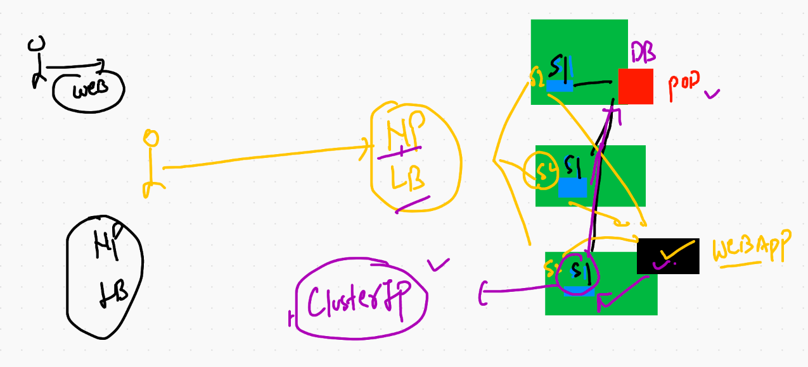

# Revision 


## switching context. 

```
❯ kubectl  config  get-contexts
CURRENT   NAME                          CLUSTER      AUTHINFO           NAMESPACE
*         kubernetes-admin@kubernetes   kubernetes   kubernetes-admin   ashuns
          minikube                      minikube     minikube           default
❯ kubectl  config  use-context  kubernetes-admin@kubernetes
Switched to context "kubernetes-admin@kubernetes".
❯ 
❯ 
❯ kubectl  get  ns
NAME                   STATUS   AGE
anwens                 Active   22h
ashuns                 Active   22h
default                Active   5d13h
devans                 Active   22h
geetha                 Active   22h
gobins                 Active   22h
kube-node-lease        Active   5d13h
kube-public            Active   5d13h
kube-system            Active   5d13h


```
# Dashboard in k8s 


## Understanding dashboard deployment 

```
 kubectl  get  ns
NAME                   STATUS   AGE
anwens                 Active   22h
ashuns                 Active   22h
default                Active   5d13h
devans                 Active   22h
geetha                 Active   22h
gobins                 Active   22h
kube-node-lease        Active   5d13h
kube-public            Active   5d13h
kube-system            Active   5d13h
kubernetes-dashboard   Active   70m
nehithans              Active   22h
pracns                 Active   22h
sains                  Active   22h
sebns                  Active   22h
srirns                 Active   22h
swarns                 Active   22h
theepns                Active   22h
❯ kubectl  get po -n kubernetes-dashboard
NAME                                         READY   STATUS    RESTARTS   AGE
dashboard-metrics-scraper-5594697f48-pktdh   1/1     Running   0          70m
kubernetes-dashboard-57c9bfc8c8-t2bc7        1/1     Running   0          70m
❯ kubectl  get svc -n kubernetes-dashboard
NAME                        TYPE        CLUSTER-IP     EXTERNAL-IP   PORT(S)         AGE
dashboard-metrics-scraper   ClusterIP   10.101.110.1   <none>        8000/TCP        70m
kubernetes-dashboard        NodePort    10.107.81.41   <none>        443:30971/TCP   71m
❯ kubectl  get sa -n kubernetes-dashboard
NAME                   SECRETS   AGE
default                1         71m
kubernetes-dashboard   1         71m
❯ kubectl  get secret -n kubernetes-dashboard
NAME                               TYPE                                  DATA   AGE
default-token-c8rp6                kubernetes.io/service-account-token   3      71m
kubernetes-dashboard-certs         Opaque                                0      71m
kubernetes-dashboard-csrf          Opaque                                1      71m
kubernetes-dashboard-key-holder    Opaque                                2      71m
kubernetes-dashboard-token-pql5d   kubernetes.io/service-account-token   3      71m
❯ kubectl  describe  secret kubernetes-dashboard-token-pql5d  -n kubernetes-dashboard
Name:         kubernetes-dashboard-token-pql5d
Namespace:    kubernetes-dashboard
Labels:       <none>
Annotations:  kubernetes.io/service-account.name: kubernetes-dashboard
              kubernetes.io/service-account.uid: cd8cd010-4536-497a-97be-d1b69c0dae66

Type:  kubernetes.io/service-account-token

Data
====
ca.crt:     1066 bytes
namespace:  20 bytes
token:      eyJhbGciOiJSUzI1NiIsImtpZCI6ImtWYzdsNkh6SFk0VmtWWFN0eFRwSUR1SkQxVWdIenNIMzFoV2JQbzE0NVEifQ.eyJpc3MiOiJrdWJlcm5ldGVzL3NlcnZpY2VhY2NvdW50Iiwia3ViZXJuZXRlcy5pby9zZXJ2aWNlYWNjb3VudC9uYW1lc3BhY2UiOiJrdWJlcm5ldGVzLWRhc2hib2FyZCIsImt1YmVybmV0ZXMuaW8vc2VydmljZWFjY291bnQvc2VjcmV0Lm5hbWUiOiJrdWJlcm5ldGVzLWRhc2hib2FyZC10b2tlbi1wcWw1ZCIsImt1YmVybmV0ZXMuaW8vc2VydmljZWFjY291bnQvc2VydmljZS1hY2NvdW50Lm5hbWUiOiJrdWJlcm5ldGVzLWRhc2hib2FyZCIsImt1YmVybmV0ZXMuaW8vc2VydmljZWFjY291bnQvc2VydmljZS1hY2NvdW50LnVpZCI6ImNkOGNkMDEwLTQ1MzYtNDk3YS05N2JlLWQxYjY5YzBk

```

## Traditional approach to deploy application 


## Introduction to Microservices


## traffice controller solution by Ingress controller 


# Deployment of Database 


## creating secret for db password storage purpose 

```
❯ kubectl  create  secret  generic  ashudbsec1  --from-literal  key1=Ciscodb1234  -n ashuns
secret/ashudbsec1 created
❯ kubectl  get  secret
NAME                  TYPE                                  DATA   AGE
ashudbsec1            Opaque                                1      12s

```

## database service as cluster ip type 



## create service for mysql Db 

```
kubectl  create  service  clusterip  ashudbsvc1  --tcp  3306  --dry-run=client  -o yaml  >>ashudb.yml

```
## Deployment of db 

```
❯ kubectl  apply -f  ashudb.yml
deployment.apps/ashudb created
service/ashudbsvc1 configured
❯ kubectl  get deploy
NAME     READY   UP-TO-DATE   AVAILABLE   AGE
ashudb   1/1     1            1           44s
❯ kubectl  get pod
NAME                      READY   STATUS    RESTARTS   AGE
ashudb-68f77b6865-zr8gj   1/1     Running   0          51s
❯ kubectl  get svc
NAME         TYPE        CLUSTER-IP      EXTERNAL-IP   PORT(S)    AGE
ashudbsvc1   ClusterIP   10.104.61.183   <none>        3306/TCP   112s

```

## LOgin into mysql POD 

```
❯ kubectl  get  po
NAME                      READY   STATUS    RESTARTS   AGE
ashudb-68f77b6865-zr8gj   1/1     Running   0          20m
❯ kubectl  exec -it  ashudb-68f77b6865-zr8gj  -- bash
root@ashudb-68f77b6865-zr8gj:/# 
root@ashudb-68f77b6865-zr8gj:/# mysql  -u root -p 
Enter password: 
Welcome to the MySQL monitor.  Commands end with ; or \g.
Your MySQL connection id is 1
Server version: 5.6.51 MySQL Community Server (GPL)

Copyright (c) 2000, 2021, Oracle and/or its affiliates. All rights reserved.

Oracle is a registered trademark of Oracle Corporation and/or its
affiliates. Other names may be trademarks of their respective
owners.

Type 'help;' or '\h' for help. Type '\c' to clear the current input statement.

mysql> 


```

## Creating webapplication deployment 

```
 kubectl  create  deployment  ashuwebapp  --image=wordpress:4.8-apache --dry-run=client -o yaml  >ashuwebapp.yml
 
```


## understanding DB connection from wordpress pod 


## creating service that can expose webapps

```
kubectl  create  service  nodeport  ashuwebsvc   --tcp  1234:80   --dry-run=client -o yaml  >>ashuwebapp.yml

```

## deployment of web app

```
❯ kubectl  apply -f  ashuwebapp.yml
deployment.apps/ashuwebapp created
service/ashuwebsvc created
❯ kubectl  get  deploy
NAME         READY   UP-TO-DATE   AVAILABLE   AGE
ashudb       1/1     1            1           146m
ashuwebapp   1/1     1            1           8s
❯ kubectl  get  pod
NAME                          READY   STATUS    RESTARTS   AGE
ashudb-68f77b6865-zr8gj       1/1     Running   0          146m
ashuwebapp-76545595c9-fq2cn   1/1     Running   0          17s
❯ kubectl  get  svc
NAME         TYPE        CLUSTER-IP      EXTERNAL-IP   PORT(S)          AGE
ashudbsvc1   ClusterIP   10.104.61.183   <none>        3306/TCP         147m
ashuwebsvc   NodePort    10.102.8.241    <none>        1234:31848/TCP   22s

```


