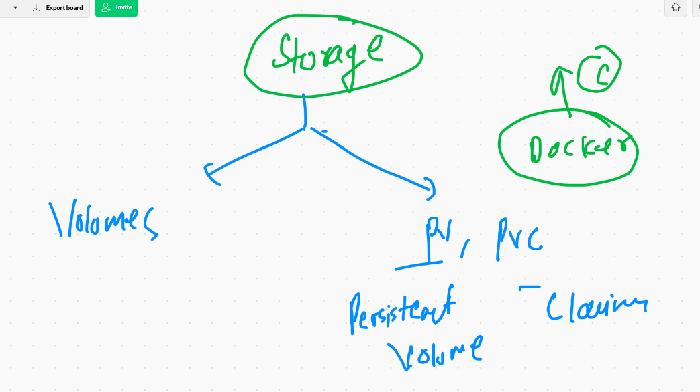
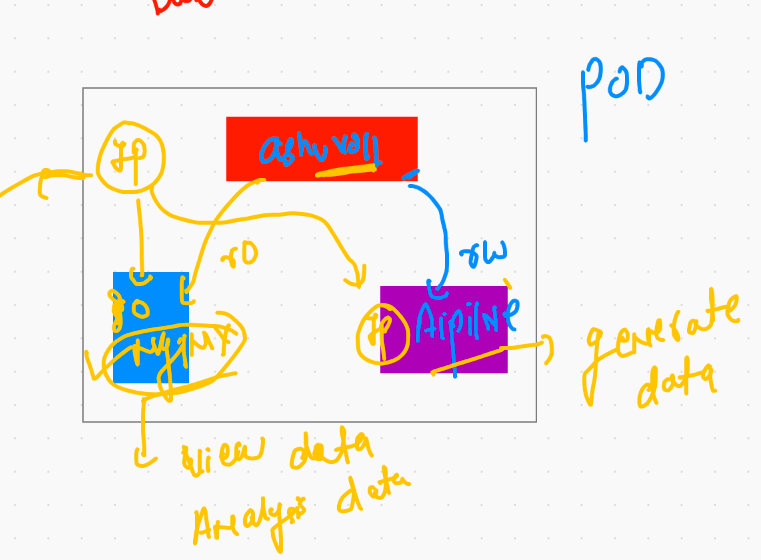

# Quick revision of docker & kubernetes 


## few ideas about minikube once more

## checking and starting minikube based cluster 

```
❯ minikube status
minikube
type: Control Plane
host: Stopped
kubelet: Stopped
apiserver: Stopped
kubeconfig: Stopped

❯ minikube start
😄  minikube v1.19.0 on Darwin 11.2.3
✨  Using the docker driver based on existing profile
👍  Starting control plane node minikube in cluster minikube
🔄  Restarting existing docker container for "minikube" ...
🐳  Preparing Kubernetes v1.20.2 on Docker 20.10.5 .../ 


```

## checking cluster context 

```
❯ minikube status
minikube
type: Control Plane
host: Running
kubelet: Running
apiserver: Running
kubeconfig: Configured

❯ kubectl config get-contexts
CURRENT   NAME                          CLUSTER      AUTHINFO           NAMESPACE
          kubernetes-admin@kubernetes   kubernetes   kubernetes-admin   
*         minikube                      minikube     minikube           default


```

## switching cluster in k8s 

```
❯ kubectl config get-contexts
CURRENT   NAME                          CLUSTER      AUTHINFO           NAMESPACE
          kubernetes-admin@kubernetes   kubernetes   kubernetes-admin   
*         minikube                      minikube     minikube           default
❯ kubectl  get  nodes
NAME       STATUS   ROLES                  AGE   VERSION
minikube   Ready    control-plane,master   42d   v1.20.2
❯ kubectl  config  use-context  kubernetes-admin@kubernetes
Switched to context "kubernetes-admin@kubernetes".
❯ kubectl config get-contexts
CURRENT   NAME                          CLUSTER      AUTHINFO           NAMESPACE
*         kubernetes-admin@kubernetes   kubernetes   kubernetes-admin   
          minikube                      minikube     minikube           default
❯ kubectl  get  nodes
NAME                            STATUS   ROLES                  AGE     VERSION
ip-172-31-69-220.ec2.internal   Ready    control-plane,master   4d13h   v1.21.0
ip-172-31-70-124.ec2.internal   Ready    <none>                 4d13h   v1.21.0
ip-172-31-75-3.ec2.internal     Ready    <none>                 4d13h   v1.21.0

```


## Out of the Box 

### How to add a new minion node into existing k8s cluster

### installing docker and starting engine 

```
[root@ip-172-31-70-176 ~]# yum  install  docker  -y
Failed to set locale, defaulting to C
Loaded plugins: extras_suggestions, langpacks, priorities, update-motd
Resolving Dependencies
--> Running transaction check
---> Package docker.x86_64 0:20.10.4-1.amzn2 will be installed
--> Processing Dependency: runc >= 1.0.0 for package: docker-20.10.4-1.amzn2.x86_64
--> Processing Dependency: libcgroup >= 0.40.rc1-5.15 for package: docker-20.10.4-1.amzn2.x86_64
--> Processing Dependency: containerd >= 1.3.2 for package: docker-20.10.4-1.amzn2.x86_64
--> Processing Dependenc

===

[root@ip-172-31-70-176 ~]# systemctl  enable --now docker  
Created symlink from /etc/systemd/system/multi-user.target.wants/docker.service to /usr/lib/systemd/system/docker.service.
[root@ip-172-31-70-176 ~]# systemctl status  docker 
● docker.service - Docker Application Container Engine
   Loaded: loaded (/usr/lib/systemd/system/docker.service; enabled; vendor preset: disabled)
   Active: active (running) since Thu 2021-04-22 05:03:04 UTC; 4s ago
     Docs: https://docs.docker.com
  Process: 3906 ExecStartPre=/usr/libexec/docker/docker-setup-runtimes.sh (code=exited, status=0/SUCCESS)
  Process: 3896 ExecSta
  
  
 ```
 
 ### step 2  Enable kernel bridge support for CNI 
 
 ```
 [root@ip-172-31-70-176 ~]# modprobe br_netfilter
[root@ip-172-31-70-176 ~]# echo '1' > /proc/sys/net/bridge/bridge-nf-call-iptables
[root@ip-172-31-70-176 ~]# 

```

### step 3  Installing. kubeadm installer 

```
cat  <<EOF  >/etc/yum.repos.d/kube.repo
[kube]
baseurl=https://packages.cloud.google.com/yum/repos/kubernetes-el7-x86_64
gpgcheck=0
EOF

-===
yum install kubeadm -y

```

### step 4 Take token from Master Node 

```
[root@ip-172-31-69-220 ~]# kubeadm  token create  --print-join-command 
kubeadm join 172.31.69.220:6443 --token ettzp4.mc39a9035qt5ox27 --discovery-token-ca-cert-hash sha256:8ed2fe7fc3f8679079eec978bb0aef615801d21ad

```
## step 5 assign token to the system you want to configure as Minion Node 

```
kubeadm join 172.31.69.220:6443 --token ettzp4.mc39a9035qt5ox27 --discovery-token-ca-cert-hash sha256:8ed2fe7fc3f8679079eec978bb0aef615801d21adc285ca5faa6456e90f41235
[preflight] Running pre-flight checks
	[WARNING IsDockerSystemdCheck]: detected "cgroupfs" as the Docker cgroup driver. The recommended driver is "systemd". Please follow the guide at https://kubernetes.io/docs/setup/cri/
	[WARNING FileExisting-tc]: tc not found in system path
	[WARNING Service-Kubelet]: kubelet se
  
  ```
  
  ### step 6 start and enable kubelet. agent 
  
  ```
  [root@ip-172-31-70-176 ~]# systemctl enable --now kubelet 
Created symlink from /etc/systemd/system/multi-user.target.wants/kubelet.service to /usr/lib/systemd/system/kubelet.service.

```


## checking from client machine for node updation 


# POd communication 

## creating a pod 

```
 kubectl  run  ashupod1  --image=alpine  --dry-run=client -o yaml  >aspod1.yaml
```

###  refer aspod1.yml  

```
❯ kubectl  replace  -f aspod1.yaml --force
pod "ashupod1" deleted
pod/ashupod1 replaced
❯ kubectl  get  pods
NAME        READY   STATUS             RESTARTS   AGE
anwepod1    0/1     CrashLoopBackOff   3          87s
ashupod1    1/1     Running            0          7s

```


### login into pod 

```
❯ kubectl   exec  -it  ashupod1  -- sh
/ # cat  /etc/os-release 
NAME="Alpine Linux"
ID=alpine
VERSION_ID=3.13.5
PRETTY_NAME="Alpine Linux v3.13"
HOME_URL="https://alpinelinux.org/"
BUG_REPORT_URL="https://bugs.alpinelinux.org/"
/ # ifconfig 
eth0      Link encap:Ethernet  HWaddr EA:AE:52:1D:21:E8  
          inet addr:192.168.229.152  Bcast:192.168.229.152  Mask:255.255.255.255
          UP BROADCAST RUNNING MULTICAST  MTU:8981  Metric:1
          RX packets:262 errors:0 dropped:0 overruns:0 frame:0
          TX packets:257 errors:0 dropped:0 overruns:0 carrier:0
          collisions:0 txqueuelen:0 
          RX bytes:24792 (24.2 KiB)  TX bytes:
	 
```

## checking output by POd 

```
kubectl   logs  ashupod1  
10076  kubectl   logs -f  ashupod1  

```

### history for pod communication and check 

```
10056  kubectl  run  ashupod1  --image=alpine  --dry-run=client -o yaml  >aspod1.yaml
10057  ls
10058  kubectl  apply  -f   aspod1.yaml 
10059  kubectl  get  pods
10060  history
10061  kubectl  get  pods
10062  kubectl  replace  -f aspod1.yaml --force 
10063  kubectl  get  pods
10064  hsitor
10065  history
10066  kubectl  get  pods
10067  kubectl  get  pods -o wide 
10068  kubectl   exec  -it  ashupod1  -- sh 
10069  history
10070  kubectl  get  po 
10071  kubectl  delete  pod  swpod1  
10072  kubectl  get  po 
10073  kubectl  get  po  swpod1  -o yaml 
10074  kubectl   get  po 
10075  kubectl   logs  ashupod1  
10076  kubectl   logs -f  ashupod1  

```

## deleting all the pods 

```
❯ kubectl  delete pods --all
pod "anwepod1" deleted
pod "ashupod1" deleted
pod "devapod1" deleted
pod "geepod1" deleted
pod "gobipod1" deleted
pod "nehitha" deleted

```

# namespace in k8s


## ALL pods , svc , deployment and rest all thing will be deployment in "Default". namespace


## kube-system namespace


## checking pods in kube-system 

```
❯ kubectl   get   pods   -n  kube-system
NAME                                                    READY   STATUS    RESTARTS   AGE
calico-kube-controllers-6d8ccdbf46-v4ft6                1/1     Running   4          4d14h
calico-node-59clh                                       1/1     Running   4          4d14h
calico-node-dzczk                                       1/1     Running   4          4d14h
calico-node-f9qxw                                       1/1     Running   4          4d14h
calico-node-fpq7p                                       1/1     Running   0          59m
coredns-558bd4d5db-lt86z                                1/1     Running   4          4d14h
coredns-558bd4d5db-w27hb                                1/1     Running   4          4d14h
etcd-ip-172-31-69-220.ec2.internal                      1/1     Running   4          4d14h
kube-apiserver-ip-172-31-69-220.ec2.internal            1/1     Running   4          4d14h
kube-controller-manager-ip-172-31-69-220.ec2.internal   1/1     Running   4          4d14h
kube-proxy-6h2wc                                        1/1     Running   4          4d14h
kube-proxy-88r5m                                        1/1     Running   0          59m
kube-proxy-cwx99                                        1/1     Running   4          4d14h
kube-proxy-qx9np                                        1/1     Running   4          4d14h
kube-scheduler-ip-172-31-69-220.ec2.internal            1/1     Running   4          4d14h

```

## creating custom namespace 

```
❯ kubectl   create  namespace    ashuns
Error from server (AlreadyExists): namespaces "ashuns" already exists
❯ 
❯ 
❯ kubectl   get  ns
NAME              STATUS   AGE
ashuns            Active   27s
default           Active   4d14h
devans            Active   12s
gobins            Active   20s
kube-node-lease   Active   4d14h
kube-public       Active   4d14h
kube-system       Active   4d14h
nehithans         Active   24s
sains             Active   14s
srirns            Active   16s

```

## Deploy pod in personal namespace 

```
❯ kubectl  apply  -f  aspod1.yaml
pod/ashupod1 created
❯ kubectl  get  pods
NAME     READY   STATUS    RESTARTS   AGE
swpod1   1/1     Running   0          37m
❯ kubectl  get  pods  -n ashuns
NAME       READY   STATUS    RESTARTS   AGE
ashupod1   1/1     Running   0          15s

░▒▓ ~/Desktop/mydocker/day4k8

```

## setting default namespace 

```
❯  kubectl   config set-context  --current  --namespace=ashuns
Context "kubernetes-admin@kubernetes" modified.
❯ 
❯ 
❯ kubectl  get   pods
NAME       READY   STATUS    RESTARTS   AGE
ashupod1   1/1     Running   0          2m22s
❯ kubectl   config get-contexts
CURRENT   NAME                          CLUSTER      AUTHINFO           NAMESPACE
*         kubernetes-admin@kubernetes   kubernetes   kubernetes-admin   ashuns
```


## Python Flask webapplication deployment 

### creating docker image  From GIthub 

```
 docker  build  -t  dockerashu/ciscoflask:v0011  https://github.com/redashu/flaskwebappnew.git\#main
[+] Building 30.5s (6/7)                                                                                                                     
 => [internal] load git source https://github.com/redashu/flaskwebappnew.git#main                                                       1.8s
 => [internal] load metadata for docker.io/library/python:latest                                                                        3.7s 
 => CACHED [1/5] FROM docker.io/library/python@sha256:07c51c65ab9c1a156a1fb51eff3ec04feff7b85b2acb7d6cc65148b218d67402                  0.0s 
 => [2/5] RUN mkdir  /webapps                                                                                                           1.7s 
 => [3/5] COPY  Flaskex  /webapps/                                                                                                      0.1s 
 => [4/5] WORKDIR /webapps                                                                                                              0.1s
 => [5/5] RUN pip3 install -r  requirements.txt                                                                                        22.9s
 => => # Successfully built flask-heroku gunicorn                                                                                           
 => => # Installing collected packages: MarkupSafe, Werkzeug, pycparser, Jinja2, itsdangerous, click, urllib3, six, idna, greenlet, Flask, c
 => => # hardet, cffi, certifi, WTForms, SQLAlchemy, requests, gunicorn, flask-heroku, bcrypt                                               
 => => # Successfully installed Flask-1.1.2 Jinja2-2.11.3 MarkupSafe-1.1.1 SQLAlchemy-1.4.11 WTForms-2.3.3 Werkzeug-1.0.1 bcrypt-3.2.0 certi
 => => # fi-2020.12.5 cffi-1.14.5 chardet-4.0.0 click-7.1.2 flask-heroku-0.1.9 greenlet-1.0.0 gunicorn-20.1.0 idna-2.10 itsdangerous-1.1.0 p
 => => # ycparser-2.20 requests-2.25.1 si
 
 ```
 
 ## now deployment of above image 
 
 ```
 kubectl  create  deployment   ashuflaskapp  --image=dockerashu/ciscoflask:v0011  --dry-run=client -o yaml  >flaskapp.yml
 
 kubectl   create  service   loadbalancer   ashusvc1  --tcp  1234:5000  --dry-run=client  -o yaml  >>flaskapp.yml
 
 ```
 
 ## understanding above yaml 
 
 
 
 
 # Deployimage app from ACR (azure container registry)
 
 ## pushing image to ACR 
 
 ```
 ❯ docker  tag   aa:v1    ciscoashu.azurecr.io/cisco:flasv1
❯ docker login   ciscoashu.azurecr.io
Username: ciscoashu
Password: 
Login Succeeded
❯ docker  push ciscoashu.azurecr.io/cisco:flasv1
The push refers to repository [ciscoashu.azurecr.io/cisco]
f48550cce7b9: Pushing [==>                                                ]   1.45MB/33.82MB
5f70bf18a086: Pushing  1.024kB
dbbc3acd9ce6: Pushing [==================================================>]  663.6kB
10e45f05b050: Pushing  8.704kB


```

## problem with image registry other than docker hub 


## understanding secret 


## creating secret 

```
 kubectl   create  secret  docker-registry  ashusec1  --docker-server=ciscoashu.azurecr.io   --docker-username=ciscoashu  --docker-password=Juws3H/bbUJvFP8YNWk   -n ashuns 
❯ 
❯ 
❯ 
❯ kubectl   get  secret
NAME                  TYPE                                  DATA   AGE
ashusec1              kubernetes.io/dockerconfigjson        1      56s
default-token-4q5rh   kubernetes.io/service-account-token   3      132m

```

# Storage in k8s



## POD & volume story 


## empydir with pod 


 ## testing alpine pod with empty dir
 
 ```
 ❯ kubectl  apply -f  storageemp.yml
pod/ashupd11 created
❯ kubectl  get  pods
NAME       READY   STATUS    RESTARTS   AGE
ashupd11   1/1     Running   0          7s
❯ kubectl  exec -it  ashupd11  -- sh
/ # 
/ # cd  /mnt/
/mnt # ls
cisco
/mnt # cd  cisco/
/mnt/cisco # ls
time.txt
/mnt/cisco # cat  time.txt 
Thu Apr 22 10:10:36 UTC 2021
Thu Apr 22 10:10:39 UTC 2021
Thu Apr 22 10:10:42 UTC 2021
Thu Apr 22 10:10:45 UTC 

```

## helper container concept 


## multi container pod 



## connecting multple container with in same pod 

```
❯ kubectl  replace -f  storageemp.yml --force
pod "ashupd11" deleted
pod/ashupd11 replaced
❯ kubectl  get  pods
NAME       READY   STATUS    RESTARTS   AGE
ashupd11   2/2     Running   0          10s
❯ kubectl  exec -it  ashupd11  -c   ashupd11  -- sh
/ # 
/ # 
/ # cd /mnt/cisco/
/mnt/cisco # ls
time.txt
/mnt/cisco # 
❯ kubectl  exec -it  ashupd11  -c  ashuc1  -- bash
root@ashupd11:/# cd /usr/share/nginx/html/
root@ashupd11:/usr/share/nginx/html# ls
time.txt
root@ashupd11:/usr/share/nginx/html# 

```


## checking container info 

```
❯ kubectl  describe pod ashupd11
Name:         ashupd11
Namespace:    ashuns
Priority:     0
Node:         ip-172-31-75-3.ec2.internal/172.31.75.3
Start Time:   Thu, 22 Apr 2021 16:15:22 +0530
Labels:       run=ashupd11
Annotations:  cni.projectcalico.org/podIP: 192.168.40.176/32
              cni.projectcalico.org/podIPs: 192.168.40.176/32
Status:       Running
IP:           192.168.40.176
IPs:
  IP:  192.168.40.176
Containers:
  ashuc1:
    Container ID:   docker://e16285b2c55f9f87f4af8dbf84aaf685c687814b4194b62695e45c22c7e2d3b3
    Image:          nginx
    Image ID:       docker-pullable://nginx@sha256:75a55d33ecc73c2a242450a9f1cc858499d468f077ea942867e662c247b5e412
    Port:           <none>
    Host Port:      <none>
    State:          Running
      Started:      Thu, 22 Apr 2021 16:15:23 +0530
    Ready:          True

```


 
  

