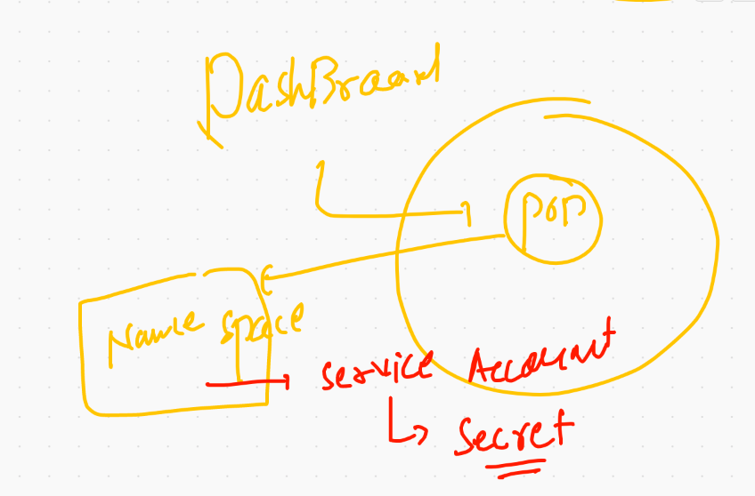

# Revision 


## switching context. 

```
❯ kubectl  config  get-contexts
CURRENT   NAME                          CLUSTER      AUTHINFO           NAMESPACE
*         kubernetes-admin@kubernetes   kubernetes   kubernetes-admin   ashuns
          minikube                      minikube     minikube           default
❯ kubectl  config  use-context  kubernetes-admin@kubernetes
Switched to context "kubernetes-admin@kubernetes".
❯ 
❯ 
❯ kubectl  get  ns
NAME                   STATUS   AGE
anwens                 Active   22h
ashuns                 Active   22h
default                Active   5d13h
devans                 Active   22h
geetha                 Active   22h
gobins                 Active   22h
kube-node-lease        Active   5d13h
kube-public            Active   5d13h
kube-system            Active   5d13h


```
# Dashboard in k8s 



## Understanding dashboard deployment 

```
 kubectl  get  ns
NAME                   STATUS   AGE
anwens                 Active   22h
ashuns                 Active   22h
default                Active   5d13h
devans                 Active   22h
geetha                 Active   22h
gobins                 Active   22h
kube-node-lease        Active   5d13h
kube-public            Active   5d13h
kube-system            Active   5d13h
kubernetes-dashboard   Active   70m
nehithans              Active   22h
pracns                 Active   22h
sains                  Active   22h
sebns                  Active   22h
srirns                 Active   22h
swarns                 Active   22h
theepns                Active   22h
❯ kubectl  get po -n kubernetes-dashboard
NAME                                         READY   STATUS    RESTARTS   AGE
dashboard-metrics-scraper-5594697f48-pktdh   1/1     Running   0          70m
kubernetes-dashboard-57c9bfc8c8-t2bc7        1/1     Running   0          70m
❯ kubectl  get svc -n kubernetes-dashboard
NAME                        TYPE        CLUSTER-IP     EXTERNAL-IP   PORT(S)         AGE
dashboard-metrics-scraper   ClusterIP   10.101.110.1   <none>        8000/TCP        70m
kubernetes-dashboard        NodePort    10.107.81.41   <none>        443:30971/TCP   71m
❯ kubectl  get sa -n kubernetes-dashboard
NAME                   SECRETS   AGE
default                1         71m
kubernetes-dashboard   1         71m
❯ kubectl  get secret -n kubernetes-dashboard
NAME                               TYPE                                  DATA   AGE
default-token-c8rp6                kubernetes.io/service-account-token   3      71m
kubernetes-dashboard-certs         Opaque                                0      71m
kubernetes-dashboard-csrf          Opaque                                1      71m
kubernetes-dashboard-key-holder    Opaque                                2      71m
kubernetes-dashboard-token-pql5d   kubernetes.io/service-account-token   3      71m
❯ kubectl  describe  secret kubernetes-dashboard-token-pql5d  -n kubernetes-dashboard
Name:         kubernetes-dashboard-token-pql5d
Namespace:    kubernetes-dashboard
Labels:       <none>
Annotations:  kubernetes.io/service-account.name: kubernetes-dashboard
              kubernetes.io/service-account.uid: cd8cd010-4536-497a-97be-d1b69c0dae66

Type:  kubernetes.io/service-account-token

Data
====
ca.crt:     1066 bytes
namespace:  20 bytes
token:      eyJhbGciOiJSUzI1NiIsImtpZCI6ImtWYzdsNkh6SFk0VmtWWFN0eFRwSUR1SkQxVWdIenNIMzFoV2JQbzE0NVEifQ.eyJpc3MiOiJrdWJlcm5ldGVzL3NlcnZpY2VhY2NvdW50Iiwia3ViZXJuZXRlcy5pby9zZXJ2aWNlYWNjb3VudC9uYW1lc3BhY2UiOiJrdWJlcm5ldGVzLWRhc2hib2FyZCIsImt1YmVybmV0ZXMuaW8vc2VydmljZWFjY291bnQvc2VjcmV0Lm5hbWUiOiJrdWJlcm5ldGVzLWRhc2hib2FyZC10b2tlbi1wcWw1ZCIsImt1YmVybmV0ZXMuaW8vc2VydmljZWFjY291bnQvc2VydmljZS1hY2NvdW50Lm5hbWUiOiJrdWJlcm5ldGVzLWRhc2hib2FyZCIsImt1YmVybmV0ZXMuaW8vc2VydmljZWFjY291bnQvc2VydmljZS1hY2NvdW50LnVpZCI6ImNkOGNkMDEwLTQ1MzYtNDk3YS05N2JlLWQxYjY5YzBk

```

## Traditional approach to deploy application 


## Introduction to Microservices


## traffice controller solution by Ingress controller 


